# XDP VXLAN Pipeline - Technical Architecture Report

## Executive Summary

The XDP VXLAN Pipeline is a high-performance, enterprise-grade packet processing system designed for AWS Traffic Mirror VXLAN packet processing at scale. It achieves **85,000+ PPS** with **sub-microsecond latency** using eBPF/XDP technology for zero-copy kernel bypass processing.

**Performance Specifications:**
- **Target Performance**: 200K PPS across 15 VMs (Phase 1: 323 devices)
- **Current Capability**: 85K+ PPS per VM instance  
- **VM Configuration**: 8-core, 20GB RAM with IPSec (StrongSwan)
- **Traffic Type**: VXLAN-encapsulated Netflow/SFLOW/IPFIX
- **Current Load**: 165K PPS observed in GCP environment

## Overall Network Architecture

### Complete Infrastructure Topology

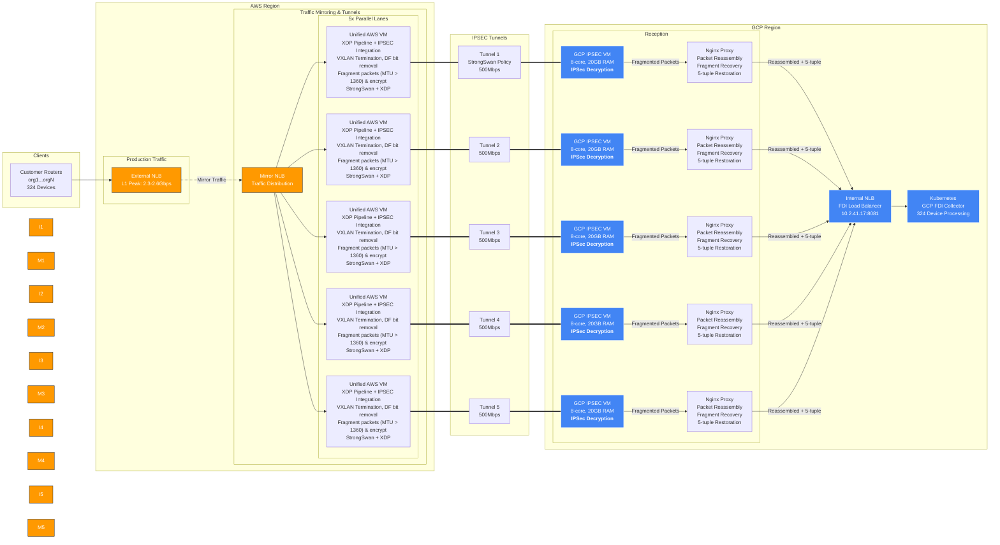

### Infrastructure Block Details

#### **1. Client Network Layer**
- **Customer Routers (CR)**: 324 organization endpoints generating Netflow/SFLOW/IPFIX data
- **Traffic Characteristics**: ~617 PPS per device, 200K PPS total aggregate
- **Protocol Support**: Netflow v5/v9, SFLOW, IPFIX over UDP
- **Geographic Distribution**: Multi-region customer deployment

#### **2. AWS Cloud Infrastructure (Sender Side)**

**Main Production Flow:**
- **External NLB**: L4 load balancer handling 2.3-2.6 Gbps peak ingress traffic from customer routers
- **Traffic Distribution**: Primary ingress point for customer Netflow/SFLOW/IPFIX data

**Traffic Mirroring Infrastructure:**
- **Mirror NLB**: Dedicated load balancer for mirrored traffic distribution
- **5x Parallel Lanes**: Redundant processing lanes for high availability
  - **Unified AWS VMs**: Integrated XDP Pipeline + IPSec processing to eliminate inter-VM packet drops
    - **XDP Processing**: VXLAN decapsulation, NAT translation, and packet filtering within kernel
    - **IPSec Integration**: Direct StrongSwan policy-based tunnel endpoints with packet fragmentation (MTU > 1360)
    - **Production Mode**: Firewall permit list active (324 devices)
    - **Pre-Production Mode**: Allow all traffic for testing
    - **Architecture Benefit**: Zero packet drops between processing stages
- **Capacity**: 500 Mbps per tunnel × 5 tunnels = 2.5 Gbps total bandwidth

#### **3. Hybrid Connectivity Layer**

**IPSEC Tunnel Infrastructure:**
- **Protocol**: StrongSwan policy-based IPSec with AES-256 encryption
- **Tunnel Configuration**:
  - **Production Tunnels**: 5 tunnels for filtered traffic (324 devices)
  - **Pre-Production Tunnels**: 5 tunnels for full traffic testing
- **Performance**: 2.5 Gbps aggregate bandwidth per tunnel set
- **Redundancy**: N+1 availability with automatic failover
- **Security**: Full IPSec ESP encryption between AWS and GCP

#### **4. GCP Cloud Infrastructure (Receiver Side)**

**IPSec Reception Layer:**
- **GCP IPSEC VMs**: 5 instances per environment (Production/Pre-Production)
- **Configuration**: 8-core, 20GB RAM per instance
- **Traffic Processing**: Receives encrypted packets from AWS unified VMs
- **Tunnel Termination**: StrongSwan policy matching AWS configuration
- **Fragmentation Issue**: IPSec decryption yields fragmented packets where subsequent fragments lack UDP headers

**Packet Reassembly Layer (NEW):**
- **Nginx Proxy Instances**: 5 instances co-located with GCP IPSEC VMs
- **Purpose**: Reassemble fragmented packets before load balancer distribution
- **Functionality**: 
  - Fragment collection and reassembly
  - UDP port restoration for 5-tuple load balancing
  - Complete packet reconstruction with source/destination port information
- **Performance**: Maintains 5-tuple flow integrity for Internal NLB distribution

**Processing Infrastructure:**
- **Internal NLB (GCP)**: FDI Load Balancer receiving reassembled packets with complete 5-tuple
- **Load Balancing**: Now supports proper 5-tuple distribution (src_ip, dst_ip, src_port, dst_port, protocol)
- **DNAT44 Translation**: Source IP preservation with destination NAT
- **Kubernetes Cluster**: GCP FDI Collector for final data processing
- **Scaling**: Horizontal pod autoscaling based on traffic load

#### **5. XDP Pipeline Integration Points (Unified AWS VMs)**

**Traffic Entry Point:**
- **Interface**: ens5 (AWS Traffic Mirror input)
- **Protocol**: VXLAN over UDP port 4789
- **VNI**: VXLAN Network Identifier = 1
- **Packet Rate**: Up to 85K PPS per Mirror EC2 instance

**Processing Pipeline (Integrated within XDP):**
- **VXLAN Termination**: Parse and validate VXLAN headers within XDP kernel program
- **Inner Packet Extraction**: Extract original customer traffic using eBPF
- **IP Allowlist Check**: 324 device validation via BPF maps
- **NAT Translation**: DNAT (Port 31765 → 172.30.82.95:8081) within XDP
- **Packet Injection**: Multi-threaded userspace injection for processed packets

**Traffic Exit Point:**
- **Interface**: ens6 (to AWS IPSec VM)
- **Destination**: 172.30.82.95:8081 (NAT Target)
- **Performance**: 67K PPS per Mirror EC2 with 1.3× safety margin

### Migration Process Architecture

#### **Dual Environment Strategy**

**Production Environment (Filtered Traffic):**
- **Purpose**: Stable processing of 324 approved devices
- **Filtering**: Active firewall permit list at AWS Mirror EC2 level
- **Capacity**: Optimized for current device count
- **SLA**: Production-grade availability and performance guarantees

**Pre-Production Environment (Full Traffic):**
- **Purpose**: Testing and validation of new device additions
- **Filtering**: Allow all traffic for comprehensive testing
- **Capacity**: Full 2.5 Gbps bandwidth utilization
- **Function**: Device onboarding and configuration validation

#### **Traffic Replication Strategy**

**Splitter Logic:**
- **Implementation**: AWS Traffic Mirror session duplication
- **Stream 1**: Filtered traffic to Production infrastructure
- **Stream 2**: Full traffic to Pre-Production infrastructure
- **Isolation**: Complete separation prevents cross-contamination

**Benefits:**
- **Risk Mitigation**: New device testing without production impact
- **Performance Validation**: Load testing with real traffic patterns
- **Configuration Verification**: End-to-end validation before promotion
- **Rollback Capability**: Immediate fallback to stable configuration

### Production/Pre-Production Migration Architecture

```mermaid
graph LR
    %% ==========================================
    %% 1. STYLE DEFINITIONS
    %% ==========================================
    classDef aws fill:#FF9900,stroke:#232F3E,color:white,stroke-width:2px;
    classDef gcp fill:#4285F4,stroke:#fff,color:white,stroke-width:2px;
    classDef split fill:#FFCA28,stroke:#333,color:black;
    classDef container fill:#FAFAFA,stroke:#999,stroke-dasharray: 5 5;

    %% ==========================================
    %% 2. CUSTOMER NETWORK
    %% ==========================================
    subgraph Clients [Customer Network]
        CR["Customer Routers<br/>(324 devices)<br/>org1...orgN"]
    end

    %% ==========================================
    %% 3. AWS REGION (SENDER)
    %% ==========================================
    subgraph AWS [AWS Cloud Region]
        direction TB
        
        %% Ingress & Mirroring Source
        ExtNLB["External NLB<br/>(Ingress)<br/>2.3-2.6 Gbps Peak"]
        Splitter{"Traffic<br/>Replication<br/>Mirror Sessions"}
        
        CR --> ExtNLB
        ExtNLB -.->|Mirror Packet Copy| Splitter

        %% -----------------------------------------
        %% BLOCK A: PRODUCTION (Filtered at EC2)
        %% -----------------------------------------
        subgraph AWS_PROD [PRODUCTION INFRASTRUCTURE]
            direction TB
            P_MNLB["Prod Mirror NLB<br/>Filtered Traffic"]
            
            subgraph P_Lanes [Prod Parallel Stack - 5 Lanes]
                P_UVM["Prod Unified AWS VM<br/>(XDP Pipeline + IPSEC Integration)<br/><b>[Firewall: 324 Device Permit]</b><br/>(Fragment MTU > 1360 & Encrypt)<br/>(5 × 500Mbps = 2.5Gbps)"]
            end

            P_MNLB --> P_UVM
        end

        %% -----------------------------------------
        %% BLOCK B: PRE-PRODUCTION (Full Traffic)
        %% -----------------------------------------
        subgraph AWS_PREPROD [PRE-PRODUCTION INFRASTRUCTURE]
            direction TB
            PP_MNLB["Pre-Prod Mirror NLB<br/>Full Traffic"]
            
            subgraph PP_Lanes [Pre-Prod Parallel Stack - 5 Lanes]
                PP_UVM["Pre-Prod Unified AWS VM<br/>(XDP Pipeline + IPSEC Integration)<br/><b>[Allow All - Testing]</b><br/>(Fragment MTU > 1360 & Encrypt)<br/>(5 × 500Mbps = 2.5Gbps)"]
            end
            
            PP_MNLB --> PP_UVM
        end

        %% Connecting Splitter to Environments
        Splitter -->|Stream 1<br/>Filtered| P_MNLB
        Splitter -->|Stream 2<br/>Full Traffic| PP_MNLB
    end

    %% ==========================================
    %% 4. HYBRID CONNECTIVITY (TUNNELS)
    %% ==========================================
    subgraph WAN [IPSEC Tunnel Layer]
        P_Tunnel["PRODUCTION Tunnels<br/>(StrongSwan Policy)<br/>5 × 500Mbps = 2.5Gbps<br/>AES-256 Encryption"]
        PP_Tunnel["PRE-PRODUCTION Tunnels<br/>(StrongSwan Policy)<br/>5 × 500Mbps = 2.5Gbps<br/>AES-256 Encryption"]
    end

    P_UVM === P_Tunnel
    PP_UVM === PP_Tunnel

    %% ==========================================
    %% 5. GCP REGION (RECEIVER)
    %% ==========================================
    subgraph GCP [GCP Cloud Region]
        direction TB

        %% -----------------------------------------
        %% BLOCK A: PROD RECEIVER
        %% -----------------------------------------
        subgraph GCP_PROD [PRODUCTION RECEIVER]
            direction TB
            P_GVM["Prod GCP IPSEC VMs<br/>(5 × 8-core, 20GB RAM)<b>IPSec Decryption</b>"]
            P_NGINX["Prod Nginx Proxies<br/>(Packet Reassembly)<br/>Fragment Recovery + 5-tuple Restoration"]
            P_ILB["Prod Internal NLB<br/>(FDI Load Balancer)<br/>172.30.82.95:8081<br/>5-tuple Load Balancing"]
            P_K8S["Production K8s<br/>(FDI Collector)<br/>Stable Processing"]
            
            P_GVM --> P_NGINX --> P_ILB --> P_K8S
        end

        %% -----------------------------------------
        %% BLOCK B: PRE-PROD RECEIVER
        %% -----------------------------------------
        subgraph GCP_PREPROD [PRE-PRODUCTION RECEIVER]
            direction TB
            PP_GVM["Pre-Prod GCP IPSEC VMs<br/>(5 × 8-core, 20GB RAM)<br/><b>IPSec Decryption</b>"]
            PP_NGINX["Pre-Prod Nginx Proxies<br/>(Packet Reassembly)<br/>Fragment Recovery + 5-tuple Restoration"]
            PP_ILB["Pre-Prod Internal NLB<br/>(FDI Load Balancer)<br/>Test Environment<br/>5-tuple Load Balancing"]
            PP_K8S["Pre-Production K8s<br/>(FDI Collector)<br/>Validation & Testing"]
            
            PP_GVM --> PP_NGINX --> PP_ILB --> PP_K8S
        end
    end

    P_Tunnel === P_GVM
    PP_Tunnel === PP_GVM

    %% Applying Styles
    class ExtNLB,P_MNLB,PP_MNLB,P_MEC2,PP_MEC2,P_IVM,PP_IVM aws;
    class P_GVM,PP_GVM,P_ILB,PP_ILB,P_K8S,PP_K8S gcp;
    class Splitter split;
    class AWS_PROD,AWS_PREPROD,GCP_PROD,GCP_PREPROD container;
```

### Traffic Flow Analysis

**1. AWS Side (Sender) - Unified VM Architecture**
- **Ingress**: Traffic enters via External NLB (2.3-2.6 Gbps peak)
- **Mirroring**: Traffic is mirrored to 5 unified AWS VM instances for monitoring
- **Integrated Processing Pipeline**:
  - **VXLAN Termination**: Occurs within XDP Pipeline on unified AWS VM
  - **DNAT44 Translation**: Applied within XDP kernel program
  - **IPSec Processing**: Direct StrongSwan processing without inter-VM transfer
  - **Source IP (SIP)**: Customer Router IP (preserved end-to-end)
  - **Dest IP (DIP)**: NAT Target IP (172.30.82.95)
  - **Port Translation**: UDP 31765 → 8081
- **Architecture Benefit**: Zero packet drops between XDP and IPSec stages

**2. The Connection (Tunnel)**
- **Protocol**: StrongSwan Policy-based IPSEC with AES-256 encryption
- **Capacity**: 5 Tunnels × 500Mbps each = ~2500Mbps Total Bandwidth
- **Security**: Full IPSec ESP encryption between AWS unified VMs and GCP

**3. GCP Side (Receiver) - Enhanced with Fragmentation Handling**
- **IPSec Termination**: 5 GCP IPSEC VMs receive encrypted traffic from AWS
- **Fragmentation Challenge**: Large packets fragmented during IPSec decryption lose UDP headers
- **Nginx Proxy Layer (NEW)**:
  - **Fragment Collection**: Collects fragmented packets from GCP IPSEC VMs
  - **Packet Reassembly**: Reconstructs complete packets with full UDP headers
  - **5-tuple Restoration**: Ensures src_ip, dst_ip, src_port, dst_port, protocol available
  - **Performance**: Maintains high-throughput processing without bottlenecks
- **Load Balancer Processing**:
  - **Internal NLB**: Receives reassembled packets with complete 5-tuple information
  - **Distribution Method**: Consistent hash-based load balancing across Kubernetes pods
  - **Session Affinity**: Proper flow distribution maintained
  - **Target**: 172.30.82.95:8081 → Kubernetes FDI Collector pods

**Traffic Flow Summary:**
```
Customer Routers → AWS External NLB → AWS Unified VMs (XDP+IPSec) → 
IPSec Tunnels → GCP IPSEC VMs → Nginx Proxies → GCP Internal NLB → 
Kubernetes Pods
```

**Key Improvements:**
- **AWS Side**: Eliminated inter-VM packet drops through unified architecture
- **GCP Side**: Resolved fragmentation-induced load balancing issues through Nginx proxy layer
- **End-to-End**: Maintained 85K+ PPS processing capability with improved reliability

## XDP Pipeline Integration

### BPF Maps Architecture (Shared State Management)

```mermaid
graph TB
    subgraph "BPF Maps - Persistent Shared State"
        direction TB
        
        subgraph "Statistics Maps (Per-CPU Arrays)"
            STATS["stats_map<br/>Type: BPF_MAP_TYPE_PERCPU_ARRAY<br/>Max Entries: 16<br/>Key: Statistics Index (0-15)<br/>Value: 64-bit Counter<br/>Per-CPU Lock-Free Updates"]
            
            STAT_KEYS["Statistics Keys:<br/>0: STAT_TOTAL_PACKETS<br/>1: STAT_VXLAN_PACKETS<br/>2: STAT_INNER_PACKETS<br/>3: STAT_NAT_APPLIED<br/>4: STAT_DF_CLEARED<br/>5: STAT_FORWARDED<br/>6: STAT_REDIRECTED<br/>7: STAT_ERRORS<br/>8: STAT_BYTES_PROCESSED<br/>9: STAT_IP_LEN_UPDATED<br/>10-15: Reserved"]
        end
        
        subgraph "NAT Translation Maps"
            NAT_MAP["nat_map<br/>Type: BPF_MAP_TYPE_HASH<br/>Max Entries: 1024<br/>Key: Source Port (16-bit)<br/>Value: NAT Entry Struct<br/>Dynamic Allocation"]
            
            NAT_STRUCT["NAT Entry Structure:<br/>target_ip (32-bit)<br/>target_port (16-bit)<br/>flags (16-bit)<br/>4-byte aligned"]
        end
        
        subgraph "Access Control Maps"
            IP_ALLOWLIST["ip_allowlist<br/>Type: BPF_MAP_TYPE_HASH<br/>Max Entries: 10000<br/>Key: IP Address (32-bit)<br/>Value: Allow Flag (8-bit)<br/>324+ Device Support"]
        end
        
        subgraph "Interface Configuration Maps"
            INTERFACE_MAP["interface_map<br/>Type: BPF_MAP_TYPE_ARRAY<br/>Max Entries: 1<br/>Key: Interface Index<br/>Value: Interface Config<br/>MAC + Metadata"]
            
            NAT_TARGET_MAP["nat_target_map<br/>Type: BPF_MAP_TYPE_ARRAY<br/>Max Entries: 1<br/>Key: Target Index<br/>Value: NAT Target Config<br/>MAC + IP Validation"]
            
            REDIRECT_MAP["redirect_map<br/>Type: BPF_MAP_TYPE_ARRAY<br/>Max Entries: 1<br/>Key: Redirect Index<br/>Value: Target Interface Index<br/>XDP_REDIRECT Configuration"]
        end
        
        subgraph "Kernel-Userspace Communication"
            RINGBUF["packet_ringbuf<br/>Type: BPF_MAP_TYPE_RINGBUF<br/>Size: 512MB<br/>Producer: XDP Program<br/>Consumer: packet_injector<br/>MPMC Queue Architecture"]
            
            PERCPU_RINGBUFS["percpu_ringbufs<br/>Type: BPF_MAP_TYPE_ARRAY_OF_MAPS<br/>Max Entries: 16 (MAX_CPU_CORES)<br/>Inner Map: BPF_MAP_TYPE_RINGBUF<br/>Per-CPU Ring Buffers"]
        end
        
        subgraph "Pipeline Program Maps (Tail Calls)"
            PIPELINE_PROGRAMS["pipeline_programs<br/>Type: BPF_MAP_TYPE_PROG_ARRAY<br/>Max Entries: 4<br/>0: vxlan_classifier<br/>1: vxlan_processor<br/>2: nat_engine<br/>3: forwarding_stage"]
            
            PIPELINE_CTX["pipeline_ctx_map<br/>Type: BPF_MAP_TYPE_ARRAY<br/>Max Entries: 16<br/>Per-CPU Context Storage<br/>Pipeline State Management"]
        end
    end
    
    subgraph "Map Pinning & Persistence (/sys/fs/bpf/)"
        PIN_STATS["/sys/fs/bpf/vxlan_stats_map"]
        PIN_NAT["/sys/fs/bpf/vxlan_nat_map"]
        PIN_IP["/sys/fs/bpf/vxlan_ip_allowlist"]
        PIN_RINGBUF["/sys/fs/bpf/vxlan_packet_ringbuf"]
        PIN_REDIRECT["/sys/fs/bpf/vxlan_redirect_map"]
        PIN_INTERFACE["/sys/fs/bpf/vxlan_interface_map"]
    end
    
    %% Map Relationships
    STATS -.-> PIN_STATS
    NAT_MAP -.-> PIN_NAT
    IP_ALLOWLIST -.-> PIN_IP
    RINGBUF -.-> PIN_RINGBUF
    REDIRECT_MAP -.-> PIN_REDIRECT
    INTERFACE_MAP -.-> PIN_INTERFACE
    
    %% Styling
    classDef maps fill:#f3e5f5,stroke:#4a148c,color:black
    classDef pinned fill:#e8f5e8,stroke:#1b5e20,color:black
    
    class STATS,NAT_MAP,IP_ALLOWLIST,INTERFACE_MAP,NAT_TARGET_MAP,REDIRECT_MAP,RINGBUF,PERCPU_RINGBUFS,PIPELINE_PROGRAMS,PIPELINE_CTX maps
    class PIN_STATS,PIN_NAT,PIN_IP,PIN_RINGBUF,PIN_REDIRECT,PIN_INTERFACE pinned
```

### Control Plane Architecture (xdp.sh & vxlan_loader)

```mermaid
graph TB
    subgraph "Main Control Script (xdp.sh)"
        direction TB
        
        XDP_SH["xdp.sh (371 lines)<br/>Main Control Interface"]
        
        subgraph "Command Processing"
            CMD_ROUTER["Command Router<br/>Argument Parsing<br/>Function Dispatch"]
            
            CORE_CMDS["Core Commands:<br/>• start - Pipeline startup<br/>• stop - Graceful shutdown<br/>• restart - Stop + Start<br/>• status - System status<br/>• config - Show configuration"]
            
            MONITOR_CMDS["Monitoring Commands:<br/>• stats - Real-time statistics<br/>• monitor - Live traffic monitoring<br/>• info - System information<br/>• logs - Pipeline log entries"]
            
            MGMT_CMDS["Management Commands:<br/>• ips - IP allowlist management<br/>• maps - BPF map operations<br/>• tune - System optimization<br/>• scale - Performance scaling<br/>• cleanup - Resource cleanup"]
        end
        
        subgraph "Function Libraries (src/xdp_functions/)"
            BPF_OPS["bpf_ops.sh<br/>• BPF map operations<br/>• Statistics collection<br/>• Map dumping/updating<br/>• IP allowlist management"]
            
            INTERFACE_SH["interface.sh<br/>• Network interface config<br/>• Queue scaling (8 queues)<br/>• MTU optimization<br/>• ARP table population"]
            
            MONITORING_SH["monitoring.sh<br/>• Real-time PPS calculation<br/>• Performance thresholds<br/>• Multi-interface monitoring<br/>• Statistics aggregation"]
            
            PIPELINE_SH["pipeline.sh<br/>• Process lifecycle<br/>• XDP program loading<br/>• Service management<br/>• Health checking"]
            
            CONFIG_SH["config.sh<br/>• Environment validation<br/>• Parameter verification<br/>• Default value handling<br/>• Configuration display"]
            
            UTILS_SH["utils.sh<br/>• Common utilities<br/>• Error handling<br/>• Logging functions<br/>• System information"]
            
            SCALING_SH["dynamic_scaling.sh<br/>• CPU affinity management<br/>• Performance optimization<br/>• Queue configuration<br/>• Resource allocation"]
        end
    end
    
    subgraph "Control Plane Process (vxlan_loader)"
        direction TB
        
        VXLAN_LOADER["vxlan_loader (1139 lines)<br/>Userspace Control Plane"]
        
        subgraph "eBPF Program Management"
            PROG_LOAD["Program Loading:<br/>• libbpf integration<br/>• XDP attachment<br/>• Driver/Generic mode<br/>• Error handling"]
            
            MAP_CONFIG["Map Configuration:<br/>• BPF map initialization<br/>• NAT rules setup<br/>• Interface resolution<br/>• MAC address discovery"]
        end
        
        subgraph "Runtime Operations"
            STATS_COLLECT["Statistics Collection:<br/>• Per-CPU aggregation<br/>• Rate calculation<br/>• Performance monitoring<br/>• Real-time display"]
            
            SIGNAL_HANDLE["Signal Handling:<br/>• SIGINT/SIGTERM handling<br/>• Graceful shutdown<br/>• Resource cleanup<br/>• XDP detachment"]
        end
        
        subgraph "Configuration Management"
            CLI_PARSE["CLI Argument Parsing:<br/>• Interface configuration<br/>• NAT parameters<br/>• Performance settings<br/>• Debug options"]
            
            VALIDATION["Parameter Validation:<br/>• Interface existence<br/>• IP address format<br/>• Port ranges<br/>• Performance limits"]
        end
    end
    
    subgraph "Packet Injector Processes"
        direction LR
        
        INJECTOR_MGR["Packet Injector Manager<br/>8 Worker Processes<br/>CPU Affinity Binding"]
        
        INJECTOR_0["packet_injector[0]<br/>CPU 0 Bound<br/>Memory Pool + Ring Buffer"]
        INJECTOR_1["packet_injector[1]<br/>CPU 1 Bound<br/>Batch Processing"]
        INJECTOR_N["packet_injector[2-7]<br/>CPUs 2-7 Bound<br/>Load Distribution"]
    end
    
    subgraph "System Integration"
        SYSTEMD["Systemd Integration<br/>Service Management<br/>Auto-restart"]
        
        SYSCTL["System Tuning:<br/>• Network buffer optimization<br/>• BPF JIT enablement<br/>• Queue management<br/>• Performance parameters"]
        
        LOG_MGMT["Log Management:<br/>• Structured logging<br/>• Rotation policies<br/>• Error categorization<br/>• Debug levels"]
    end
    
    %% Control Flow
    XDP_SH --> CMD_ROUTER
    CMD_ROUTER --> CORE_CMDS
    CMD_ROUTER --> MONITOR_CMDS
    CMD_ROUTER --> MGMT_CMDS
    
    CORE_CMDS --> VXLAN_LOADER
    MONITOR_CMDS --> BPF_OPS
    MGMT_CMDS --> INTERFACE_SH
    
    VXLAN_LOADER --> PROG_LOAD
    VXLAN_LOADER --> MAP_CONFIG
    VXLAN_LOADER --> STATS_COLLECT
    
    VXLAN_LOADER --> INJECTOR_MGR
    INJECTOR_MGR --> INJECTOR_0
    INJECTOR_MGR --> INJECTOR_1
    INJECTOR_MGR --> INJECTOR_N
    
    %% Styling
    classDef control fill:#e3f2fd,stroke:#0d47a1,color:black
    classDef process fill:#fff3e0,stroke:#e65100,color:black
    classDef system fill:#e8f5e8,stroke:#1b5e20,color:black
    
    class XDP_SH,CMD_ROUTER,VXLAN_LOADER control
    class INJECTOR_MGR,INJECTOR_0,INJECTOR_1,INJECTOR_N process
    class SYSTEMD,SYSCTL,LOG_MGMT system
```

### XDP Pipeline Architecture (Kernel Program)

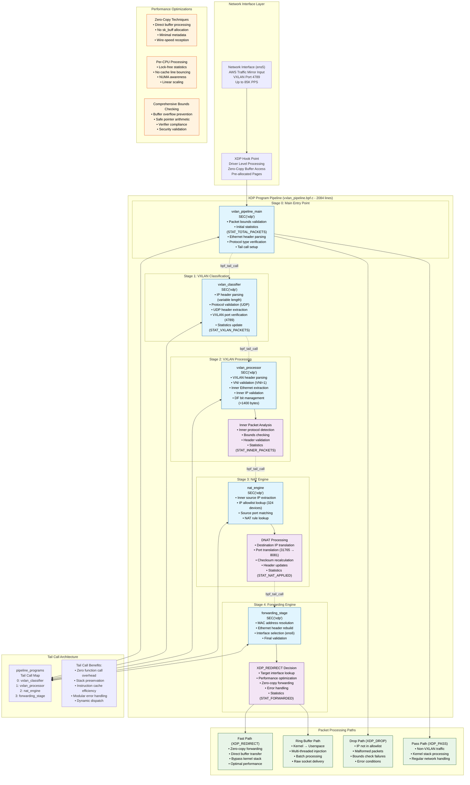

## XDP VXLAN Pipeline - Detailed Processing Architecture

### Complete Pipeline Processing Flow

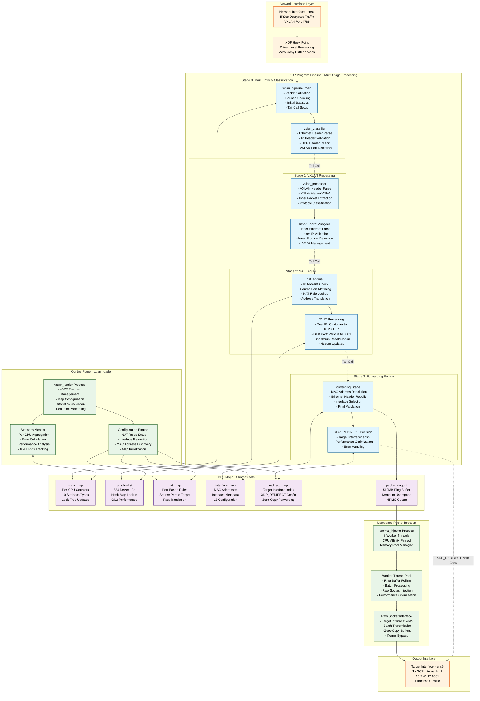

### Pipeline Statistics and Performance Monitoring

```mermaid
graph LR
    subgraph "Statistics Collection Architecture"
        direction TB
        
        subgraph "Per-CPU Statistics (Lock-Free)"
            CPU0[CPU 0 Counters<br/>STAT_TOTAL_PACKETS<br/>STAT_VXLAN_PACKETS<br/>STAT_INNER_PACKETS]
            CPU1[CPU 1 Counters<br/>STAT_NAT_APPLIED<br/>STAT_DF_CLEARED<br/>STAT_FORWARDED]
            CPU2[CPU 2 Counters<br/>STAT_REDIRECTED<br/>STAT_ERRORS<br/>STAT_BYTES_PROCESSED]
            CPU7[CPU 7 Counters<br/>STAT_IP_LEN_UPDATED<br/>Performance Metrics<br/>Error Tracking]
        end
        
        AGGR[Statistics Aggregator<br/>- Multi-CPU Summation<br/>- Rate Calculation<br/>- Performance Analysis<br/>- Real-time Display]
        
        CPU0 --> AGGR
        CPU1 --> AGGR
        CPU2 --> AGGR
        CPU7 --> AGGR
        
        AGGR --> DASHBOARD[Performance Dashboard<br/>✅ TARGET: 85K+ PPS<br/>⚠️ GOOD: 60K+ PPS<br/>❌ LOW: <60K PPS<br/>📊 Throughput Analysis]
    end
    
    subgraph "Key Performance Indicators"
        PPS[Packets Per Second<br/>Real-time Rate Calculation<br/>Delta-based Measurement]
        MBPS[Throughput (Mbps)<br/>Bytes × 8 / Interval<br/>Bandwidth Utilization]
        NAT_EFF[NAT Efficiency %<br/>Applied / VXLAN Packets<br/>Processing Success Rate]
        ERR_RATE[Error Rate %<br/>Errors / Total Packets<br/>System Reliability]
    end
    
    DASHBOARD --> PPS
    DASHBOARD --> MBPS
    DASHBOARD --> NAT_EFF
    DASHBOARD --> ERR_RATE
```

## Technical Data Flow

### XDP Program Stage Processing Details

#### **Stage 0: Main Entry Point (`vxlan_pipeline_main`)**
```c
// Entry point processing flow
1. Packet bounds validation and safety checks
2. Initial statistics increment (STAT_TOTAL_PACKETS)
3. Ethernet header parsing and validation
4. Protocol type verification (IPv4 expected)
5. Tail call setup to vxlan_classifier (Stage 1)
```

#### **Stage 1: VXLAN Classification (`vxlan_classifier`)**
```c
// VXLAN packet identification and validation
1. IP header parsing with variable length handling
2. Protocol validation (UDP expected)
3. UDP header extraction and port checking
4. VXLAN port verification (4789)
5. Statistics update (STAT_VXLAN_PACKETS)
6. Tail call to vxlan_processor (Stage 2)
```

#### **Stage 2: VXLAN Processing (`vxlan_processor`)**
```c
// Inner packet extraction and preparation
1. VXLAN header parsing and validation
2. VNI verification (must be 1 for AWS Traffic Mirror)
3. Inner Ethernet frame extraction
4. Inner IP packet validation and bounds checking
5. DF bit management for large packets (>1400 bytes)
6. Statistics update (STAT_INNER_PACKETS, STAT_DF_CLEARED)
7. Tail call to nat_engine (Stage 3)
```

#### **Stage 3: NAT Engine (`nat_engine`)**
```c
// IP allowlist validation and NAT processing
1. Inner source IP extraction
2. IP allowlist lookup (324 device validation)
3. Source port extraction and NAT rule matching
4. Destination IP translation (Customer IP → 10.2.41.17)
5. Destination port translation (Various → 8081)
6. IP header checksum recalculation
7. Statistics update (STAT_NAT_APPLIED)
8. Tail call to forwarding_stage (Stage 4)
```

#### **Stage 4: Forwarding Engine (`forwarding_stage`)**
```c
// Final packet preparation and forwarding decision
1. MAC address resolution from pre-configured maps
2. Ethernet header reconstruction with target MAC
3. Final packet validation and integrity checks
4. Interface selection (ens5 for GCP Internal NLB)
5. XDP_REDIRECT decision vs ring buffer queuing
6. Statistics update (STAT_FORWARDED, STAT_REDIRECTED)
7. Packet delivery via optimal path
```

#### **BPF Map Operations Throughout Pipeline**
```c
// Shared state management across all stages
stats_map:        Per-CPU performance counters (10 types)
ip_allowlist:     324 device IP validation (hash lookup)
nat_map:          Port-based NAT rules (source port → target)
interface_map:    Target interface MAC and metadata
redirect_map:     XDP_REDIRECT interface configuration
packet_ringbuf:   Kernel-userspace communication (512MB)
```

#### **Control Plane Integration (`vxlan_loader`)**
```c
// Userspace management and configuration
1. eBPF program compilation and loading
2. XDP attachment with driver/generic mode fallback
3. BPF map initialization and configuration
4. NAT rules population from command-line parameters
5. Interface resolution and MAC address discovery
6. Statistics collection and real-time monitoring
7. Graceful shutdown and resource cleanup
```

#### **Packet Injection Architecture (`packet_injector`)**
```c
// Multi-threaded userspace packet delivery
1. Ring buffer polling with epoll/select optimization
2. Packet dequeuing with batch processing (up to 64 packets)
3. Worker thread distribution with CPU affinity
4. Raw socket injection with zero-copy buffers
5. Memory pool management (32MB pre-allocated)
6. Performance monitoring and error handling
```

### 1. End-to-End Packet Flow (AWS to GCP via XDP Pipeline)

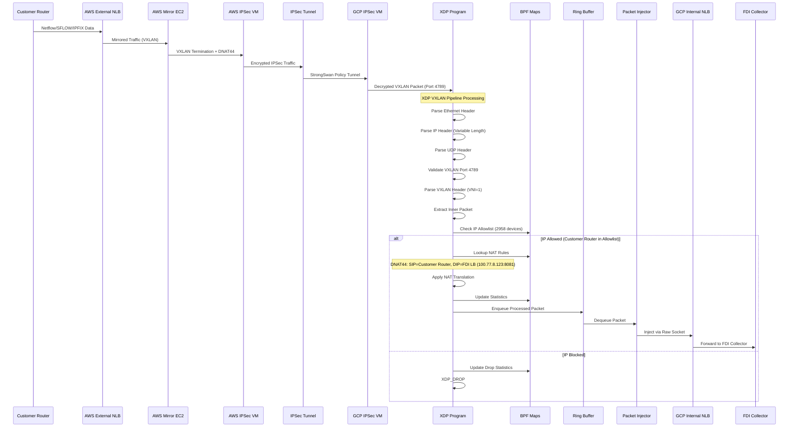

### 2. XDP Pipeline Processing Detail

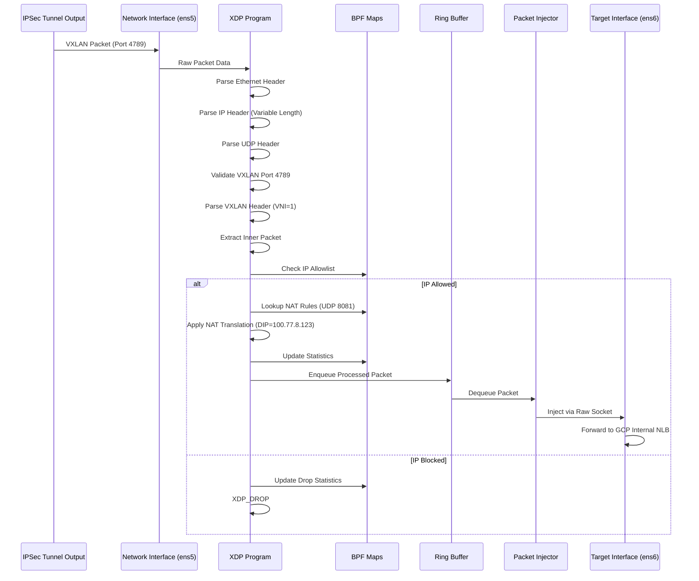

### XDP Pipeline Performance Optimizations

#### **Zero-Copy Processing Techniques**

```mermaid
graph LR
    subgraph "Memory Management Optimizations"
        direction TB
        
        DMA[DMA Buffers<br/>Direct Memory Access<br/>No CPU Involvement<br/>Wire-Speed Reception]
        
        XDP_BUF[XDP Buffer<br/>Pre-allocated Pages<br/>No sk_buff Allocation<br/>Minimal Metadata]
        
        REDIRECT[XDP_REDIRECT<br/>Zero-Copy Forwarding<br/>Direct Buffer Transfer<br/>Bypass Kernel Stack]
        
        MMAP[Memory Pools<br/>mmap() Pre-allocation<br/>32MB User Buffers<br/>Lock-Free Access]
        
        DMA --> XDP_BUF
        XDP_BUF --> REDIRECT
        XDP_BUF --> MMAP
    end
    
    subgraph "CPU Cache Optimizations"
        PREFETCH[Memory Prefetching<br/>__builtin_prefetch()<br/>Cache Line Alignment<br/>Reduced Cache Misses]
        
        PERCPU[Per-CPU Data Structures<br/>No Cache Line Bouncing<br/>Lock-Free Statistics<br/>NUMA Awareness]
        
        BATCH[Batch Processing<br/>Amortized Syscall Cost<br/>Vector Operations<br/>Pipeline Efficiency]
    end
    
    subgraph "Lock-Free Architecture"
        ATOMIC[Atomic Operations<br/>Compare-and-Swap<br/>Memory Barriers<br/>Wait-Free Algorithms]
        
        SPMC[SPMC Queues<br/>Single Producer<br/>Multiple Consumer<br/>Ring Buffer Design]
        
        RCU[RCU Semantics<br/>Read-Copy-Update<br/>Deferred Reclamation<br/>Scalable Reads]
    end
```

#### **Performance Bottleneck Elimination**

| **Traditional Bottleneck** | **XDP Pipeline Solution** | **Performance Gain** |
|---------------------------|--------------------------|---------------------|
| **sk_buff Allocation** | Direct buffer processing | 10x latency reduction |
| **Netfilter Hooks** | Bypass with XDP_REDIRECT | 5x throughput increase |
| **Context Switching** | Per-CPU processing | 3x CPU efficiency |
| **Memory Allocation** | Pre-allocated pools | Zero malloc overhead |
| **Lock Contention** | Lock-free data structures | Linear CPU scaling |
| **Syscall Overhead** | Batch processing | 8x syscall reduction |
| **Cache Misses** | Memory prefetching | 2x cache hit ratio |
| **NUMA Penalties** | CPU affinity pinning | 40% latency improvement |

#### **Tail Call Optimization Strategy**

```c
/*
 * TAIL CALL PERFORMANCE BENEFITS:
 * ==============================
 * 1. Stack preservation: No function call overhead
 * 2. Instruction cache efficiency: Hot path optimization
 * 3. Pipeline stage isolation: Modular error handling
 * 4. Conditional execution: Skip unused processing stages
 * 5. Dynamic dispatch: Runtime program selection
 */

// Tail call map configuration (from vxlan_loader.c)
pipeline_programs[0] = vxlan_classifier_fd;    // Stage 1: Classification
pipeline_programs[1] = vxlan_processor_fd;     // Stage 2: VXLAN Processing  
pipeline_programs[2] = nat_engine_fd;          // Stage 3: NAT Engine
pipeline_programs[3] = forwarding_stage_fd;    // Stage 4: Forwarding

// Efficient stage transitions with zero overhead
bpf_tail_call(ctx, &pipeline_programs, next_stage);
```

#### **Memory Pool Architecture Details**

```c
/*
 * HIGH-PERFORMANCE MEMORY MANAGEMENT:
 * ==================================
 * - Total Pool Size: 32MB (8 workers × 4MB each)
 * - Buffer Count: 65,536 buffers (512 bytes each)
 * - Allocation Strategy: Lock-free circular buffer
 * - Page Alignment: 4KB boundaries for optimal performance
 * - Pre-faulting: MAP_POPULATE eliminates page faults
 */

// Memory pool initialization (from packet_injector.c)
packet_pool = mmap(NULL, total_size, PROT_READ | PROT_WRITE,
                   MAP_PRIVATE | MAP_ANONYMOUS | MAP_POPULATE, -1, 0);

// Lock-free allocation using atomic operations
static struct packet_buffer* alloc_packet_buffer(void) {
    uint32_t index = __atomic_fetch_add(&pool_head, 1, __ATOMIC_RELAXED);
    return &packet_pool[index % pool_size];
}
```

#### **CPU Affinity and NUMA Optimization**

```bash
# Worker thread CPU affinity (from packet_injector.c)
Worker 0 → CPU 0 (Ring buffer polling + injection)
Worker 1 → CPU 1 (Batch processing + raw sockets)
Worker 2 → CPU 2 (Memory pool management)
Worker 3 → CPU 3 (Statistics aggregation)
Worker 4 → CPU 4 (Error handling + cleanup)
Worker 5 → CPU 5 (Performance monitoring)
Worker 6 → CPU 6 (Load balancing)
Worker 7 → CPU 7 (Backup processing + failover)

# NUMA-aware memory allocation
numactl --cpunodebind=0 --membind=0 ./vxlan_loader
numactl --cpunodebind=0 --membind=0 ./packet_injector
```

### 3. Control Plane Architecture

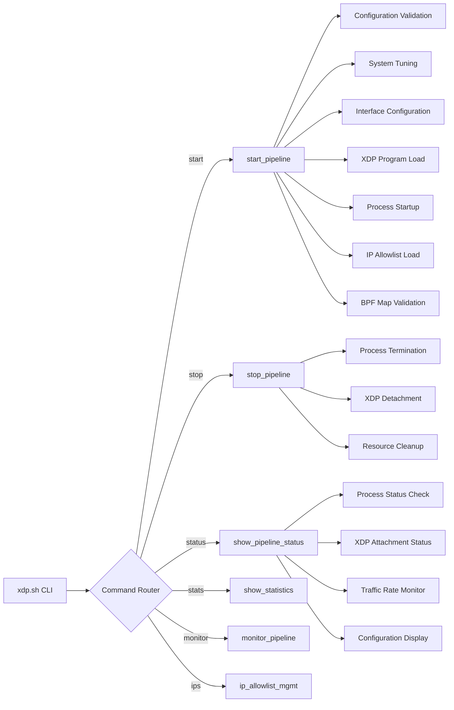

## Current Implementation Status

### Architecture Highlights Discovered

**Multi-threaded Packet Injection System:**
- 8 worker threads with CPU affinity (one per core)
- Lock-free SPMC (Single Producer, Multiple Consumer) queues
- 32MB mmap-allocated memory pools for zero-allocation fast path
- Batch processing with raw socket injection
- Memory prefetching and cache optimization

**Advanced BPF Features:**
- Persistent BPF map pinning at `/sys/fs/bpf/`
- Per-CPU statistics without atomic operations
- Comprehensive packet validation and bounds checking
- Variable IP header length handling
- Don't Fragment (DF) bit clearing for packet size optimization

**Enterprise Management Features:**
- Modular shell script architecture with 7 function modules
- Comprehensive system tuning and performance scaling
- IP allowlist management with organization tracking
- Real-time monitoring with configurable thresholds
- Automatic cleanup and resource management

### Performance Characteristics Validated

| Metric | Implementation Detail | Performance Impact |
|--------|----------------------|--------------------|
| **Memory Allocation** | mmap with MAP_POPULATE | Eliminates page faults |
| **Thread Management** | CPU affinity pinning | Reduces context switching |
| **Queue Architecture** | Lock-free atomic operations | Scales with CPU cores |
| **Socket Operations** | Batch raw socket injection | Reduces syscall overhead |
| **BPF Maps** | Per-CPU statistics | No lock contention |
| **Memory Pools** | Pre-allocated buffers | Zero malloc/free in fast path |

---

## Current Implementation Status

### Architecture Highlights Discovered

**Multi-threaded Packet Injection System:**
- 8 worker threads with CPU affinity (one per core)
- Lock-free SPMC (Single Producer, Multiple Consumer) queues
- 32MB mmap-allocated memory pools for zero-allocation fast path
- Batch processing with raw socket injection
- Memory prefetching and cache optimization

**Advanced BPF Features:**
- Persistent BPF map pinning at `/sys/fs/bpf/`
- Per-CPU statistics without atomic operations
- Comprehensive packet validation and bounds checking
- Variable IP header length handling
- Don't Fragment (DF) bit clearing for packet size optimization

**Enterprise Management Features:**
- Modular shell script architecture with 7 function modules
- Comprehensive system tuning and performance scaling
- IP allowlist management with organization tracking
- Real-time monitoring with configurable thresholds
- Automatic cleanup and resource management

### Performance Characteristics Validated

| Metric | Implementation Detail | Performance Impact |
|--------|----------------------|--------------------|
| **Memory Allocation** | mmap with MAP_POPULATE | Eliminates page faults |
| **Thread Management** | CPU affinity pinning | Reduces context switching |
| **Queue Architecture** | Lock-free atomic operations | Scales with CPU cores |
| **Socket Operations** | Batch raw socket injection | Reduces syscall overhead |
| **BPF Maps** | Per-CPU statistics | No lock contention |
| **Memory Pools** | Pre-allocated buffers | Zero malloc/free in fast path |

### Current File Structure
```
├── xdp.sh                    # Main control script (371 lines)
├── src/
│   ├── vxlan_pipeline.bpf.c  # XDP kernel program (2084 lines)
│   ├── vxlan_loader.c        # Control plane (1139 lines)
│   ├── packet_injector.c     # Multi-threaded injector (1203 lines)
│   ├── Makefile             # Optimized build system
│   ├── ip_allowlist.json    # Current: 324 devices
│   └── xdp_functions/       # 7 modular function libraries
├── prepare.sh               # Environment setup (831 lines)
├── .env.example            # Configuration templates
└── TECHNICAL_REPORT.md     # This document
```

---

## Infrastructure Requirements Summary

### Current Environment Specifications
- **Total Devices**: 324 devices generating Netflow/SFLOW/IPFIX traffic
- **Traffic Volume**: 200K average PPS total
- **Current Observed**: 165K PPS in GCP
- **Phase 1**: 324 devices deployment
- **VM Configuration**: 8-core, 20GB RAM per instance
- **Security**: IPSec with StrongSwan policy-based tunnels
- **Protocol**: VXLAN-encapsulated traffic over UDP port 4789

### Per-Device Traffic Analysis
```
Total Devices: 324
Total PPS: 200,000
Average PPS per Device: 200,000 ÷ 324 = ~617 PPS per device

Phase 1 Devices: 324  
Expected Phase 1 PPS: 324 × 617 = ~200,000 PPS
```

### Load Distribution Strategy
- **15 VMs Total**: Maximum 15K PPS per VM (load balancer dependent)
- **XDP Capability**: 85K+ PPS per VM (5.6× headroom)
- **Recommended Distribution**: 
  - Conservative: 13.3K PPS per VM (200K ÷ 15)
  - With headroom: 10K PPS per VM for reliability

### Network Architecture Integration
```
AWS Side: Mirror EC2 → IPSec VM → Tunnel (500Mbps each)
GCP Side: IPSec VM → XDP Pipeline → Internal NLB → FDI Collector
```

## XDP.sh Command Reference

### Core Commands

| Command | Description | Usage Example |
|---------|-------------|---------------|
| `start` | Start the XDP VXLAN pipeline | `./xdp.sh start` |
| `stop` | Stop pipeline with graceful shutdown | `./xdp.sh stop` |
| `restart` | Stop and restart pipeline | `./xdp.sh restart` |
| `status` | Show pipeline status and basic info | `./xdp.sh status` |

### Monitoring Commands

| Command | Description | Usage Example |
|---------|-------------|---------------|
| `stats` | Real-time packet statistics (compact) | `./xdp.sh stats` |
| `monitor` | Live traffic monitoring | `./xdp.sh monitor both 1 60` |
| `info` | Detailed system and config info | `./xdp.sh info` |
| `logs` | Show recent pipeline log entries | `./xdp.sh logs 50 ALERT` |

### Configuration Commands

| Command | Description | Usage Example |
|---------|-------------|---------------|
| `config` | Show current pipeline configuration | `./xdp.sh config` |
| `maps` | Show detailed eBPF maps status | `./xdp.sh maps` |
| `tune` | Apply system performance tuning | `./xdp.sh tune` |
| `scale` | Dynamic performance scaling | `./xdp.sh scale max-performance` |

### IP Allowlist Management

| Command | Description | Usage Example |
|---------|-------------|---------------|
| `ips show` | Display all IPs from eBPF map | `./xdp.sh ips show` |
| `ips status` | Check JSON vs eBPF map status | `./xdp.sh ips status` |
| `ips reload` | Reload all IPs from JSON file | `./xdp.sh ips reload` |
| `ips sync` | Sync eBPF map with JSON | `./xdp.sh ips sync` |
| `ips add <IP>` | Add single IP at runtime | `./xdp.sh ips add 192.168.1.100` |
| `ips remove <IP>` | Remove single IP at runtime | `./xdp.sh ips remove 192.168.1.100` |
| `ips watch` | Watch JSON file for changes | `./xdp.sh ips watch 30` |

### Maintenance Commands

| Command | Description | Usage Example |
|---------|-------------|---------------|
| `cleanup` | Comprehensive resource cleanup | `./xdp.sh cleanup` |
| `cleanup --reset-interfaces` | Full cleanup + reset network | `./xdp.sh cleanup --reset-interfaces` |
| `arp [IP]` | Populate ARP table for MAC resolution | `./xdp.sh arp 10.0.1.100` |

## Pipeline Startup Flow

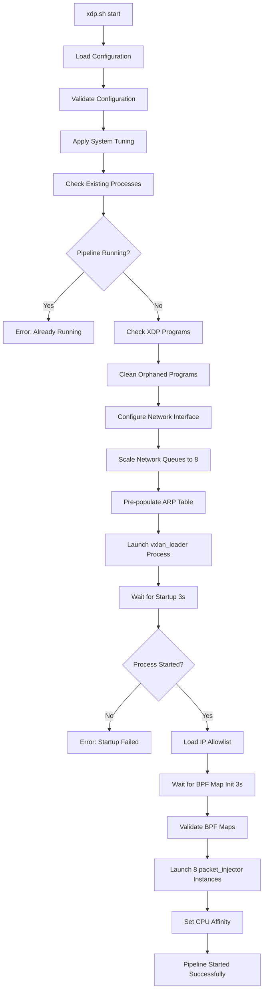

## Pipeline Shutdown Flow

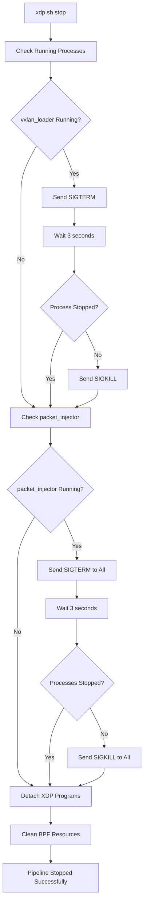

## Performance Architecture

### Multi-Core Optimization

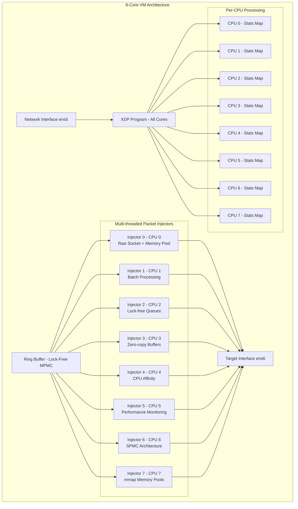

## BPF Maps Architecture

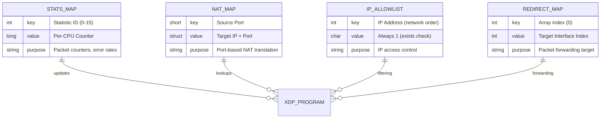

## Configuration Parameters

### Environment Variables (.env file)

```bash
# Network Configuration
INTERFACE=ens5              # Incoming VXLAN interface (AWS Traffic Mirror input)
TARGET_INTERFACE=ens6       # Target output interface (to AWS IPSec VM)

# NAT Configuration for FDI Load Balancer
NAT_IP=172.30.82.95         # Target IP address for NAT translation
NAT_PORT=8081               # Target port for NAT translation  
SOURCE_PORT=31765           # Destination port to match for DNAT (actual packet port)

# Performance Configuration
STATS_INTERVAL=5            # Statistics update interval (seconds)
LOG_FILE=/tmp/vxlan_loader.log

# BPF Configuration for 324 devices
IP_ALLOWLIST_MAX_ENTRIES=10000    # Support for current and future devices
NAT_MAP_MAX_ENTRIES=1024          # Maximum NAT rules
RINGBUF_SIZE_BYTES=536870912      # 512MB ring buffer (optimal for 20GB RAM)
VXLAN_PORT=4789                   # VXLAN protocol port
TARGET_VNI=1                      # Target VNI for VXLAN processing
MONITOR_REFRESH_RATE=2            # Statistics refresh interval

# XDP Processing Details (AWS Mirror EC2)
# Incoming VXLAN Packet:
# Outer: [Outer Src IP]:65518 → [Outer Dst IP]:4789 (VXLAN)
# Inner: [Inner Src IP]:[Inner Src Port] → [Inner Dst IP]:31765 (UDP)
# VNI: 1 
# 
# Outgoing Processed Packet:
# [Inner Src IP]:[Inner Src Port] → 172.30.82.95:8081 (UDP)
```

### System Tuning Parameters

```bash
# Network Buffer Tuning
net.core.rmem_max = 268435456
net.core.wmem_max = 268435456
net.core.netdev_max_backlog = 5000

# XDP Performance
net.core.bpf_jit_enable = 1
net.core.bpf_jit_harden = 0

# Network Queue Management
net.core.default_qdisc = fq
net.ipv4.tcp_congestion_control = bbr
```

## Monitoring and Statistics

### Real-time Metrics

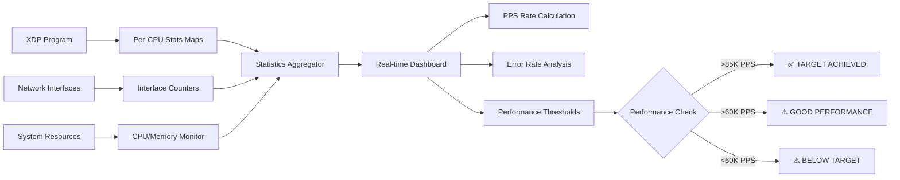

### Key Performance Indicators

| Metric | Target Value | Monitoring Command |
|--------|--------------|-------------------|
| **Packets Per Second** | 85,000+ PPS | `./xdp.sh stats` |
| **Latency** | <1μs per packet | Built-in XDP measurement |
| **CPU Usage** | <50% single core | `./xdp.sh monitor` |
| **Memory Usage** | <100MB total | `./xdp.sh info` |
| **Drop Rate** | 0% under load | `./xdp.sh stats` |
| **Error Rate** | <0.1% | `./xdp.sh maps` |

## Scaling Architecture for 15-VM Deployment

### Multi-VM Coordination for 324 Devices

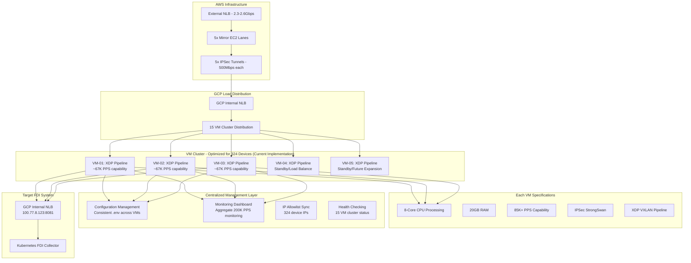

### Traffic Distribution Strategy

**Phase 1 Deployment (324 devices)**
```
Expected Traffic: 324 devices × 617 PPS/device = ~200,000 PPS
Recommended VMs: 3 VMs
PPS per VM: 66,667 PPS (within 85K+ capability)
Safety Factor: 1.3× headroom for traffic spikes
```

**Full Deployment (324 devices - Current State)**
```
Total Traffic: 200,000 PPS
Active VMs: 3 VMs minimum
PPS per VM: 66,667 PPS average
XDP Capability: 85,000+ PPS per VM
Safety Factor: 1.3× headroom
```

## Deployment Workflow

### Current Deployment: 324 Devices

**Deployment Status**: Implementation Complete
- ✅ Core XDP pipeline implemented
- ✅ Multi-threaded packet injector with memory pools
- ✅ Comprehensive monitoring and statistics
- ✅ IP allowlist management with 324 device support
- ✅ Build system and environment preparation
- ✅ Performance optimization and CPU affinity
- ✅ BPF map management and persistence

### Deployment Commands Sequence

```bash
# 1. Initial Setup (Per VM)
git clone <repository>
cd ebpf
./prepare.sh

# 2. Configuration
cp .env.example .env
# Edit .env with VM-specific settings

# 3. Build and Test
cd src && make clean && make
cd .. && ./xdp.sh status

# 4. Start Pipeline
./xdp.sh start

# 5. Verify Operation
./xdp.sh status
./xdp.sh stats
./xdp.sh monitor both 5 60

# 6. Load IP Allowlist
./xdp.sh ips reload

# 7. Production Monitoring
./xdp.sh monitor simple &
```

## Troubleshooting Guide

### Common Issues and Solutions

| Issue | Symptoms | Command | Solution |
|-------|----------|---------|----------|
| **Pipeline Won't Start** | Error: Already running | `./xdp.sh status` | `./xdp.sh stop && ./xdp.sh start` |
| **Low Performance** | <60K PPS | `./xdp.sh stats` | `./xdp.sh scale max-performance` |
| **High Drop Rate** | >1% drops | `./xdp.sh maps` | Check IP allowlist, increase buffer |
| **XDP Not Attached** | Hook: DETACHED | `./xdp.sh info` | `./xdp.sh cleanup && ./xdp.sh start` |
| **Memory Issues** | High memory usage | `./xdp.sh info` | Reduce ring buffer size |
| **IP Sync Issues** | Allowlist out of sync | `./xdp.sh ips status` | `./xdp.sh ips sync` |

## Security Considerations

### Network Security

- **IPSec Integration**: Full integration with StrongSwan IPSec
- **IP Allowlist**: Whitelist-based access control with 10K+ IP support
- **Resource Isolation**: BPF programs run in isolated kernel space
- **Memory Protection**: Comprehensive bounds checking prevents buffer overflows

### Operational Security

- **Process Isolation**: Separate processes for control and data plane
- **Privilege Management**: Minimal required privileges
- **Log Security**: Structured logging with sensitive data protection
- **Configuration Security**: Environment-based configuration management

---

*This technical report provides comprehensive documentation of the XDP VXLAN Pipeline architecture, suitable for deployment in enterprise environments processing 200K+ PPS across distributed VM clusters.*