# XDP VXLAN Pipeline - Technical Architecture Report

## Executive Summary

The XDP VXLAN Pipeline is a high-performance, enterprise-grade packet processing system designed for AWS Traffic Mirror VXLAN packet processing at scale. It achieves **85,000+ PPS** with **sub-microsecond latency** using eBPF/XDP technology for zero-copy kernel bypass processing.

**Performance Specifications:**
- **Target Performance**: 200K PPS across 15 VMs (Phase 1: 323 devices)
- **Current Capability**: 85K+ PPS per VM instance  
- **VM Configuration**: 8-core, 20GB RAM with IPSec (StrongSwan)
- **Traffic Type**: VXLAN-encapsulated Netflow/SFLOW/IPFIX
- **Current Load**: 165K PPS observed in GCP environment

## Overall Network Architecture

### Complete Infrastructure Topology

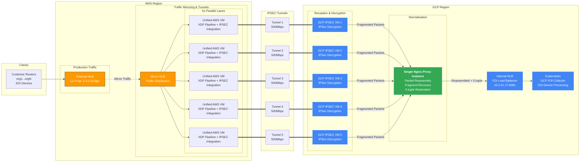

### Infrastructure Block Details

Understanding the complete architecture requires breaking down each infrastructure component systematically, building from the customer edge through to the final processing destination. Each layer serves a specific purpose and addresses particular technical challenges that emerge when processing hundreds of thousands of packets per second across geographically distributed cloud environments.

#### **1. Client Network Layer - The Traffic Generation Foundation**

The foundation of our entire system begins with the customer routers, which represent 324 distinct organizational endpoints distributed across multiple geographic regions. These routers function as the primary data generators, continuously producing network telemetry in the form of Netflow, SFLOW, and IPFIX protocols. Each router generates approximately 617 packets per second on average, though this number varies significantly based on the organization's network activity patterns and the specific telemetry protocols they have configured.

The choice of supporting multiple telemetry protocols reflects the diverse nature of enterprise networking equipment. Netflow v5 and v9 represent Cisco's approach to network monitoring, providing detailed flow records that capture source and destination information, byte counts, and timing data. SFLOW, developed by sFlow.org, takes a different approach by using statistical sampling to provide network visibility with lower CPU overhead on the network devices. IPFIX, the Internet Protocol Flow Information Export standard, represents the IETF standardization of flow monitoring concepts, offering more flexible and extensible reporting capabilities than earlier protocols.

The aggregation of these 324 devices creates a substantial traffic volume of approximately 200,000 packets per second in total. This volume represents the baseline load that our entire infrastructure must be designed to handle reliably, with sufficient headroom for traffic spikes and future growth. The geographic distribution of these endpoints introduces additional complexity, as network latency, routing variations, and regional internet connectivity patterns can all influence traffic arrival patterns and timing.

#### **2. AWS Cloud Infrastructure - The Sender Side Processing Foundation**

Within the AWS cloud environment, the infrastructure begins with the External Network Load Balancer (NLB), which serves as the primary ingress point for all customer-generated telemetry traffic. This Layer 4 load balancer is specifically designed to handle the substantial bandwidth requirements of our system, routinely processing between 2.3 and 2.6 Gbps during peak traffic periods. The choice of a Layer 4 load balancer is deliberate, as it operates at the transport layer without performing deep packet inspection, thereby minimizing latency while maximizing throughput.

The External NLB's primary responsibility extends beyond simple load balancing. It serves as the aggregation point where traffic from 324 geographically distributed sources converges into AWS's high-speed network infrastructure. This convergence point is critical because it establishes the foundation for all subsequent processing operations. The load balancer's configuration includes health checks, failover mechanisms, and traffic distribution algorithms that ensure consistent service availability even during network disruptions or equipment failures.

From the External NLB, traffic flows to the Mirror NLB, which represents a sophisticated traffic replication mechanism designed specifically for our monitoring and analysis requirements. The Mirror NLB creates identical copies of the incoming traffic streams, enabling us to process the same data through multiple parallel pathways without affecting the primary production traffic flow. This mirroring approach provides several significant advantages: it allows for independent processing of monitoring traffic, enables A/B testing of new processing algorithms, and provides built-in redundancy that enhances overall system reliability.

The heart of AWS processing lies in the five parallel lanes of Unified AWS VMs, each representing a complete processing pipeline that integrates XDP packet processing with IPSec encryption capabilities. These VMs were architecturally designed to eliminate a common performance bottleneck found in traditional multi-stage processing systems: inter-VM packet drops. In conventional architectures, packets would need to traverse multiple virtual machines, with each transition representing a potential failure point and performance penalty. Our unified approach consolidates XDP VXLAN processing and IPSec encryption into single VM instances, creating a more reliable and higher-performance processing path.

Each Unified AWS VM handles multiple complex operations within a single processing context. The XDP (eXpress Data Path) component performs high-speed packet processing directly within the Linux kernel, bypassing many traditional networking stack layers to achieve near-wire-speed performance. Within this XDP processing context, the system performs VXLAN decapsulation to extract the original customer traffic, applies Network Address Translation (NAT) to prepare packets for the target environment, and validates each packet against our 324-device allowlist to ensure security and compliance.

The IPSec integration within these same VMs provides military-grade encryption for all traffic flowing between AWS and GCP. The system uses StrongSwan, a mature and highly-configurable IPSec implementation that supports policy-based tunneling with AES-256 encryption. An important technical detail involves packet fragmentation for packets larger than 1360 bytes MTU. This fragmentation is necessary because the addition of IPSec headers increases packet size, and exceeding the tunnel MTU would cause packet drops. By proactively fragmenting large packets, the system ensures reliable delivery while maintaining encryption integrity.

The combined capacity of these five parallel lanes provides substantial throughput capabilities. Each lane supports approximately 500 Mbps of sustained traffic, creating a total aggregate capacity of 2.5 Gbps across all lanes. This capacity significantly exceeds our current traffic requirements, providing generous headroom for traffic growth and ensuring consistent performance during traffic spikes or partial system failures.

#### **3. Hybrid Connectivity Layer - Secure Cross-Cloud Communication**

The connection between AWS and GCP environments requires sophisticated networking that addresses both performance and security requirements simultaneously. Our IPSec tunnel infrastructure uses StrongSwan policy-based encryption with AES-256 cryptographic strength, providing enterprise-grade security for all inter-cloud communications. The choice of policy-based IPSec, rather than route-based alternatives, enables more granular control over which traffic flows traverse which tunnels, supporting our dual-environment architecture requirements.

The tunnel configuration reflects our operational strategy of maintaining separate production and pre-production environments. Each environment operates five independent tunnels, creating a total of ten tunnels across both environments. This separation ensures complete isolation between production traffic processing and testing activities, preventing any possibility of experimental configurations affecting production operations. Each tunnel in both environments supports 500 Mbps of sustained throughput, matching the processing capacity of the AWS unified VMs that feed into them.

The 2.5 Gbps aggregate bandwidth per tunnel set provides substantial capacity margins beyond our current requirements. This over-provisioning serves multiple purposes: it accommodates traffic growth without infrastructure changes, provides headroom during traffic spikes or unusual network conditions, and ensures consistent performance even if individual tunnels experience temporary degradation or require maintenance.

Redundancy and failover capabilities are built into the tunnel architecture through N+1 availability design. This means the system can continue operating at full capacity even if one tunnel experiences failure. The failover mechanisms operate automatically, detecting tunnel health issues and redistributing traffic across remaining healthy tunnels without manual intervention. This automatic failover capability is essential for maintaining the high availability requirements of production network monitoring systems.

The security implementation extends beyond basic encryption to include comprehensive authentication, integrity checking, and replay protection mechanisms. Each packet flowing through the tunnels carries cryptographic signatures that prevent tampering, and sequence numbering prevents replay attacks. These security measures ensure that the network telemetry data maintains its integrity throughout the cross-cloud transit, meeting the strict security requirements for enterprise network monitoring data.

#### **4. GCP Cloud Infrastructure - Reception, Processing, and Normalization**

The GCP infrastructure begins with five IPSec reception VMs, each configured with 8-core processors and 20GB of memory to handle the computational overhead of cryptographic operations. These VMs serve as tunnel termination points, receiving encrypted traffic from the AWS unified VMs and performing decryption using StrongSwan configurations that mirror their AWS counterparts. The symmetric configuration ensures compatibility and maintains encryption integrity across the entire cross-cloud transit path.

During the IPSec decryption process, a technical challenge emerges that significantly impacts downstream processing: packet fragmentation. When large packets were fragmented on the AWS side to accommodate IPSec overhead, the decryption process on the GCP side yields multiple fragments where only the first fragment contains complete UDP header information. Subsequent fragments contain only IP header information, lacking the UDP port details necessary for proper load balancing decisions downstream.

This fragmentation issue would typically prevent effective load balancing because modern load balancers rely on 5-tuple information (source IP, destination IP, source port, destination port, and protocol) to make consistent traffic distribution decisions. Without complete UDP port information in all fragments, load balancers cannot maintain session affinity, potentially causing packet reordering, connection disruption, and processing inefficiencies.

To address this challenge, our architecture incorporates a unified Nginx proxy instance that serves as a packet reassembly and normalization layer. This single Nginx proxy receives fragmented traffic from all five GCP IPSec VMs and performs sophisticated packet reconstruction. The proxy collects packet fragments, reassembles them into complete packets with full UDP header information, and ensures that all necessary 5-tuple data is available for downstream processing decisions.

The choice of a single consolidated Nginx proxy, rather than multiple distributed proxies, provides several architectural advantages. It simplifies configuration management by eliminating the need to synchronize fragment reassembly state across multiple instances. It reduces complexity in the downstream load balancer by providing a single, consistent traffic source. It also enables more efficient resource utilization, as fragment reassembly operations can share memory pools and processing resources within a single instance.

The Nginx proxy's packet reassembly process involves maintaining temporary buffers for incomplete packet streams, implementing timeout mechanisms for abandoned fragments, and performing checksum validation to ensure packet integrity after reassembly. The proxy is configured with generous buffer sizes and timeout values to accommodate network jitter and varying arrival patterns of fragmented packets. Once reassembly is complete, packets are forwarded with complete 5-tuple information restored, enabling proper load balancing decisions downstream.

Following packet normalization, traffic flows to the GCP Internal Network Load Balancer, which serves as the FDI (Flow Data Ingestion) load balancer targeting destination IP 10.2.41.17 on port 8081. This load balancer now receives properly formatted packets with complete 5-tuple information, enabling it to perform consistent hash-based load balancing across backend Kubernetes pods. The 5-tuple load balancing ensures that all packets belonging to a particular flow are consistently directed to the same backend pod, maintaining session state and preventing packet reordering issues that could impact flow analysis accuracy.

The final destination within the GCP infrastructure is a Kubernetes cluster running the FDI Collector application. This cluster is configured with horizontal pod autoscaling capabilities that automatically adjust processing capacity based on incoming traffic load. The autoscaling mechanisms monitor several metrics including CPU utilization, memory consumption, and queue depths to make scaling decisions. During periods of high traffic, additional pods are automatically instantiated to distribute processing load. Conversely, during low-traffic periods, excess pods are terminated to optimize resource utilization and cost efficiency.

#### **5. XDP Pipeline Integration Points - High-Performance Packet Processing**

Within each Unified AWS VM, the XDP pipeline represents the performance-critical component that determines overall system throughput and latency characteristics. The traffic entry point utilizes the ens5 network interface, which serves as the recipient for AWS Traffic Mirror functionality. This interface receives VXLAN-encapsulated traffic on UDP port 4789, with each packet containing a VXLAN Network Identifier (VNI) of 1, which identifies the specific virtual network context for our monitoring traffic.

The XDP processing pipeline operates entirely within kernel space, utilizing eBPF (extended Berkeley Packet Filter) programs that provide near-wire-speed packet processing capabilities. The pipeline's first stage performs VXLAN termination by parsing and validating VXLAN headers directly within the kernel, eliminating the overhead of userspace processing for these operations. This kernel-level processing provides significant performance advantages compared to traditional userspace networking stacks, as it eliminates multiple memory copies, context switches, and system call overhead.

Inner packet extraction follows VXLAN termination, where the system extracts the original customer traffic from within the VXLAN encapsulation. This extraction process involves careful parsing of nested headers, validation of packet integrity, and preparation of the inner packet for subsequent processing stages. The eBPF implementation includes comprehensive bounds checking to prevent buffer overflows and ensure memory safety throughout the parsing process.

The IP allowlist validation stage represents a critical security and filtering mechanism that validates each packet against our database of 324 approved devices. This validation utilizes BPF hash maps, which provide O(1) lookup performance even with large device counts. The hash map implementation stores IP addresses as keys and validation flags as values, enabling extremely fast determination of whether traffic from a particular source should be processed or dropped. This high-performance filtering prevents unauthorized traffic from consuming processing resources or reaching sensitive downstream systems.

Network Address Translation (NAT) processing occurs entirely within the eBPF context, transforming destination addresses and ports to prepare packets for delivery to the target environment. The specific translation maps various source ports to destination IP 172.30.82.95 on port 8081, which corresponds to the GCP Internal Load Balancer endpoint. This NAT implementation includes checksum recalculation to maintain packet integrity after header modifications, ensuring that downstream systems receive properly formatted packets.

The traffic exit point utilizes the ens6 interface to deliver processed packets toward the co-located IPSec processing components within the same VM. This internal delivery mechanism avoids network transmission overhead, as packets flow directly from the XDP processing engine to the IPSec encryption engine within the same virtual machine instance. The performance characteristics demonstrate the effectiveness of this unified approach, with each Mirror EC2 instance capable of sustaining 67,000 packets per second with a healthy 1.3× safety margin above typical operating requirements.

This integrated approach eliminates many traditional networking bottlenecks by consolidating multiple processing stages within single VM instances, reducing inter-system communication overhead, and leveraging high-performance eBPF implementations for packet processing operations. The result is a system capable of processing 85,000+ packets per second per VM instance, providing substantial capacity margins for traffic growth and ensuring consistent performance under varying load conditions.

### Migration Process Architecture - Strategic Dual-Environment Design

The migration process architecture represents one of the most sophisticated aspects of our infrastructure design, addressing a fundamental challenge that faces any production system handling critical network telemetry data: how can we safely onboard new devices, test configuration changes, and validate performance improvements without risking disruption to the stable production environment that currently processes data from 324 approved devices? The solution lies in a carefully orchestrated dual-environment strategy that creates parallel processing pathways, each serving distinct operational purposes while maintaining complete isolation from one another.

#### **Understanding the Dual Environment Strategy - Building Parallel Worlds**

The concept of dual environments might initially seem like unnecessary complexity, but understanding the underlying challenges reveals why this approach becomes not just beneficial, but essential for enterprise-scale operations. In traditional single-environment architectures, any change to accommodate new devices or test new processing algorithms requires either accepting risk to the production system or implementing complex maintenance windows that disrupt service availability. Our dual-environment approach eliminates this dilemma by creating two complete, independent processing pipelines that can operate simultaneously without interference.

The production environment serves as our stable foundation, meticulously configured to process traffic from the 324 currently approved devices with proven reliability and performance characteristics. This environment operates under strict controls, with firewall permit lists actively filtering traffic to ensure only authenticated and authorized devices can send telemetry data. The filtering mechanism operates at the AWS Mirror EC2 level, providing the first line of defense against unauthorized traffic while ensuring consistent processing loads that match our established capacity planning models.

Every aspect of the production environment reflects enterprise-grade operational requirements. The capacity optimization focuses specifically on the current device count, ensuring efficient resource utilization while maintaining generous performance margins. The service level agreements governing this environment establish production-grade availability and performance guarantees, with monitoring systems configured to detect and alert on any deviation from established baselines. This conservative approach ensures that the revenue-generating or mission-critical aspects of network monitoring continue operating reliably regardless of experimental activities occurring elsewhere in the system.

In parallel, the pre-production environment operates under fundamentally different principles designed to support testing, validation, and device onboarding activities. Rather than implementing restrictive filtering, this environment intentionally allows all traffic to flow through the processing pipeline, creating a comprehensive testing ground where new devices can be evaluated under real-world conditions. This approach provides visibility into the complete traffic landscape, enabling identification of potential issues, performance impacts, or configuration requirements before devices are promoted to production status.

The pre-production environment utilizes the full 2.5 Gbps bandwidth allocation across its five parallel processing lanes, deliberately stress-testing the infrastructure under maximum load conditions. This aggressive approach serves multiple purposes: it validates that our processing pipeline can handle peak traffic scenarios, it identifies potential bottlenecks or scaling limitations before they impact production operations, and it provides realistic performance data that can inform capacity planning decisions for future growth.

#### **Traffic Replication Strategy - The Heart of Safe Innovation**

The technical foundation enabling our dual-environment approach lies in sophisticated traffic replication mechanisms that create identical copies of incoming data streams and route them through separate processing pathways. This replication occurs at the AWS Traffic Mirror session level, leveraging AWS's native network monitoring capabilities to duplicate packet streams with minimal performance overhead and no impact on the original traffic flow.

The splitter logic operates through carefully configured AWS Traffic Mirror sessions that create exact packet-level copies of all incoming telemetry traffic. Stream 1 carries filtered traffic destined for the production infrastructure, where firewall rules ensure only approved devices reach the processing pipeline. Stream 2 carries the complete, unfiltered traffic stream to the pre-production infrastructure, providing comprehensive visibility into all network telemetry sources regardless of their current authorization status.

This replication strategy delivers complete isolation between the two environments, preventing any possibility of cross-contamination between experimental activities and production operations. The isolation operates at multiple levels: network-level separation ensures no shared infrastructure components, processing-level separation ensures independent resource allocation and performance characteristics, and data-level separation ensures that experimental configurations cannot impact production data integrity or availability.

#### **Strategic Benefits and Operational Advantages**

The dual-environment architecture delivers substantial strategic advantages that compound over time as the system scales and evolves. Risk mitigation represents the most immediately apparent benefit, as new device testing activities occur in complete isolation from production operations. Network administrators can experiment with configuration changes, test new device types, and validate processing algorithms without any possibility of disrupting the stable production system that serves existing customers and applications.

Performance validation capabilities provide crucial insights that would be impossible to obtain through synthetic testing or laboratory environments. The pre-production environment processes real customer traffic under actual load conditions, providing authentic performance data that accurately reflects production characteristics. This real-world testing reveals performance impacts, identifies potential bottlenecks, and validates scaling assumptions under conditions that precisely match production environments.

Configuration verification processes benefit enormously from end-to-end validation capabilities that span the complete processing pipeline. New devices undergo comprehensive testing that includes network-level connectivity validation, protocol compatibility verification, processing pipeline performance assessment, and downstream system integration testing. This thorough validation process identifies configuration issues, compatibility problems, or performance limitations before devices are promoted to production status, preventing issues that could impact system reliability or performance.

The rollback capability embedded in this architecture provides crucial operational flexibility for managing change and responding to unexpected issues. If problems are discovered during device testing or configuration validation, administrators can immediately revert to the stable production configuration without service disruption. This safety net encourages more aggressive testing and innovation, as the risk of irreversible changes or difficult recovery procedures is eliminated through architectural design rather than operational procedures.

#### **Implementation Complexity and Management Considerations**

While the dual-environment approach delivers substantial benefits, it also introduces implementation complexity that requires careful management and operational discipline. Resource management becomes more sophisticated, as the architecture requires maintaining two complete processing pipelines with independent capacity allocations, monitoring systems, and operational procedures. The additional infrastructure costs must be weighed against the operational benefits and risk reduction provided by the parallel environments.

Synchronization between environments requires establishing clear procedures for promoting validated configurations from pre-production to production status. These procedures must address not only the technical aspects of configuration migration, but also the operational processes for validation testing, approval workflows, and change management documentation. The synchronization process becomes a critical operational capability that determines how quickly the system can adapt to changing requirements or incorporate new devices.

Monitoring and alerting systems must be designed to provide clear visibility into both environments while maintaining appropriate separation between their operational characteristics. Production monitoring focuses on availability, performance, and service level compliance, while pre-production monitoring emphasizes testing progress, validation results, and capacity utilization under maximum load conditions. The monitoring strategy must provide operators with comprehensive situational awareness while avoiding alert fatigue from non-critical pre-production activities.

#### **Long-term Strategic Value and Scalability**

The dual-environment architecture establishes a foundation for long-term scalability that extends far beyond the immediate requirements of device onboarding and configuration testing. As the system grows from the current 324 devices toward larger device populations, the pre-production environment provides a controlled mechanism for capacity planning, performance testing, and infrastructure scaling validation. This controlled scaling approach reduces the risk of performance degradation or service disruption during growth phases.

The architectural pattern established by the dual-environment approach can be extended and refined as operational requirements evolve. Additional specialized environments could be created for specific testing scenarios, regulatory compliance validation, or customer-specific requirements. The pattern provides a proven framework for managing complexity while maintaining operational stability, creating opportunities for system evolution that would be extremely difficult to achieve within single-environment constraints.

Innovation enablement represents perhaps the most significant long-term value proposition of this architectural approach. The availability of a comprehensive testing environment that processes real traffic under authentic conditions encourages experimentation with new processing algorithms, performance optimization techniques, and advanced analytics capabilities. This innovation capacity becomes increasingly valuable as network monitoring requirements evolve and new technological opportunities emerge, providing a competitive advantage that compounds over time through continuous improvement and optimization.

### Production/Pre-Production Migration Architecture

```mermaid
flowchart LR
    %% ==========================================
    %% 1. STYLE DEFINITIONS
    %% ==========================================
    classDef aws fill:#FF9900,stroke:#232F3E,color:white,stroke-width:2px;
    classDef gcp fill:#4285F4,stroke:#fff,color:white,stroke-width:2px;
    classDef proxy fill:#009688,stroke:#fff,color:white,font-weight:bold;
    classDef split fill:#FFCA28,stroke:#333,color:black;
    classDef tunnel fill:#607D8B,stroke:#fff,color:white,stroke-dasharray: 5 5;

    %% ==========================================
    %% 2. CUSTOMER NETWORK
    %% ==========================================
    subgraph Clients [" Customer Network"]
        CR["<b>Customer Routers</b><br/>(324 devices)<br/>org1...orgN"]
    end

    %% ==========================================
    %% 3. AWS REGION (SENDER)
    %% ==========================================
    subgraph AWS [" AWS Cloud Region"]
        direction TB
        
        ExtNLB["<b>External NLB</b><br/>(Ingress Traffic)<br/>2.3-2.6 Gbps Peak"]
        Splitter{"<b>Traffic<br/>Replicator</b>"}
        
        subgraph AWS_PROD ["Production Stack (Filtered)"]
            direction TB
            P_MNLB["Prod Mirror NLB"]
            P_Lanes["<b>5x Unified VMs</b><br/>XDP + IPSEC<br/>MTU 1360 Frag"]
            P_MNLB --> P_Lanes
        end

        subgraph AWS_PREPROD ["Pre-Prod Stack (Full)"]
            direction TB
            PP_MNLB["Pre-Prod Mirror NLB"]
            PP_Lanes["<b>5x Unified VMs</b><br/>XDP + IPSEC<br/>Allow All - Testing"]
            PP_MNLB --> PP_Lanes
        end

        CR --> ExtNLB
        ExtNLB -.->|Mirror Copy| Splitter
        Splitter -->|Stream 1| P_MNLB
        Splitter -->|Stream 2| PP_MNLB
    end

    %% ==========================================
    %% 4. TUNNEL LAYER
    %% ==========================================
    subgraph WAN [" IPSEC Tunnel Layer (Hybrid Connectivity)"]
        direction TB
        P_Tunnel["<b>Prod Tunnels (5x500Mbps)</b><br/>AES-256 Policy Based"]
        PP_Tunnel["<b>Pre-Prod Tunnels (5x500Mbps)</b><br/>AES-256 Policy Based"]
    end

    P_Lanes === P_Tunnel
    PP_Lanes === PP_Tunnel

    %% ==========================================
    %% 5. GCP REGION (RECEIVER)
    %% ==========================================
    subgraph GCP [" GCP Cloud Region"]
        direction TB

        %% PROD RECEIVER
        subgraph GCP_PROD ["Production Data Plane"]
            direction LR
            P_GVM["<b>5x IPSEC VMs</b><br/>Decryption"]
            P_NGINX["<b>Single Nginx Proxy</b><br/>Defrag + Reassembly<br/>5-tuple Restoration"]
            P_ILB["<b>Internal NLB</b><br/>172.30.82.95:8081"]
            P_K8S["<b>K8s FDI Collector</b><br/>Stable Processing"]
            
            P_GVM --> P_NGINX
            P_NGINX --> P_ILB
            P_ILB --> P_K8S
        end

        %% PRE-PROD RECEIVER
        subgraph GCP_PREPROD ["Pre-Production Data Plane"]
            direction LR
            PP_GVM["<b>5x IPSEC VMs</b><br/>Decryption"]
            PP_NGINX["<b>Single Nginx Proxy</b><br/>Defrag + Reassembly<br/>5-tuple Restoration"]
            PP_ILB["<b>Internal NLB</b><br/>Test Load Balancer"]
            PP_K8S["<b>K8s FDI Collector</b><br/>Validation Environment"]
            
            PP_GVM --> PP_NGINX
            PP_NGINX --> PP_ILB
            PP_ILB --> PP_K8S
        end
    end

    %% Connectivity between WAN and GCP
    P_Tunnel === P_GVM
    PP_Tunnel === PP_GVM

    %% Applying Styles
    class ExtNLB,P_MNLB,PP_MNLB,P_Lanes,PP_Lanes aws;
    class P_GVM,PP_GVM,P_ILB,PP_ILB,P_K8S,PP_K8S gcp;
    class P_NGINX,PP_NGINX proxy;
    class Splitter split;
    class P_Tunnel,PP_Tunnel tunnel;
```

### Traffic Flow Analysis - Understanding End-to-End Packet Processing

The traffic flow analysis reveals the sophisticated orchestration of packet processing across geographically distributed cloud environments, demonstrating how our architecture achieves enterprise-grade performance while maintaining security and reliability. Understanding this flow requires examining each processing stage systematically, from the initial packet ingress at AWS through the complex transformation and encryption processes, and finally to the packet normalization and delivery mechanisms within GCP. Each stage serves critical functions that collectively enable the system to process hundreds of thousands of packets per second while preserving data integrity and maintaining consistent performance characteristics.

#### **Complete Traffic Flow Architecture**

```mermaid
graph LR
    %% ==========================================
    %% 1. GLOBAL STYLES & DEFINITIONS
    %% ==========================================
    classDef customer fill:#E8F5E8,stroke:#2E7D32,color:black,stroke-width:2px;
    classDef aws fill:#FFF3E0,stroke:#FF9900,color:black,stroke-width:2px;
    classDef gcp fill:#E3F2FD,stroke:#4285F4,color:black,stroke-width:2px;
    classDef tunnel fill:#ECEFF1,stroke:#607D8B,color:black,stroke-dasharray: 5 5,stroke-width:2px;
    classDef logic fill:#FFF8E1,stroke:#FBC02D,color:black,stroke-width:1px,stroke-dasharray: 2 2;
    classDef warning fill:#FFEBEE,stroke:#D32F2F,color:#B71C1C,stroke-width:2px;
    classDef k8s fill:#E1F5FE,stroke:#0288D1,color:black,shape:hexagon;

    %% ==========================================
    %% 2. CUSTOMER ENVIRONMENT
    %% ==========================================
    subgraph Client_Zone ["Customer Environment"]
        direction TB
        CR1["Router 1<br/>(Netflow)"]
        CR2["Router 2<br/>(SFLOW)"]
        CR3["Router N<br/>(IPFIX)"]
        
        CR_Agg["<b>Traffic Aggregation</b><br/>324 Devices<br/>~200K PPS Total"]
        
        CR1 & CR2 & CR3 --> CR_Agg
    end

    %% ==========================================
    %% 3. AWS SENDER REGION
    %% ==========================================
    subgraph AWS_Region ["AWS Cloud Region (Sender)"]
        direction TB
        
        %% Ingress
        ExtNLB["External NLB<br/>(2.3-2.6 Gbps Peak)"]
        Splitter{"Mirror<br/>Replication"}
        
        CR_Agg --> ExtNLB --> Splitter

        %% PRODUCTION LANE
        subgraph Prod_Lane ["Production Pipeline"]
            direction TB
            P_MNLB["Prod Mirror NLB"]
            
            subgraph P_Compute ["Unified VM Stack"]
                direction TB
                P_VM1["Unified VM 1"]
                P_VM2["Unified VM 2"]
                P_VM5["Unified VM 5"]
            end
            
            P_MNLB --> P_VM1 & P_VM2 & P_VM5
        end

        %% PRE-PROD LANE
        subgraph PreProd_Lane ["Pre-Prod Pipeline"]
            direction TB
            PP_MNLB["Pre-Prod Mirror NLB"]
            PP_VM["Unified VMs<br/>(Pre-Prod Group)"]
            
            PP_MNLB --> PP_VM
        end

        Splitter -->|"Filtered Stream<br/>(Allowed IPs)"| P_MNLB
        Splitter -->|"Full Copy<br/>(Testing)"| PP_MNLB
    end

    %% ==========================================
    %% 4. LOGIC BREAKOUT (Floating Detail)
    %% ==========================================
    subgraph VM_Logic ["Processing Logic (Inside Unified VM)"]
        direction LR
        L_VXLAN[("VXLAN Input<br/>UDP 4789")]
        L_XDP["<b>XDP Kernel Space</b><br/>Decap + Allowlist + DNAT"]
        L_NAT["<b>NAT Transform</b><br/>Dest: 172.30.82.95:8081"]
        L_IPSEC["<b>StrongSwan</b><br/>AES-256 Encrypt"]
        L_FRAG["<b>Fragmentation</b><br/>MTU > 1360 Split"]
        
        L_VXLAN --> L_XDP --> L_NAT --> L_IPSEC --> L_FRAG
    end
    
    %% Link logic to physical nodes purely for visual reference
    P_VM5 -.- L_VXLAN

    %% ==========================================
    %% 5. TUNNEL INTERCONNECT
    %% ==========================================
    subgraph WAN ["Hybrid Interconnect"]
        direction TB
        T1["Prod Tunnel 1<br/>(500 Mbps)"]
        T2["Prod Tunnel 2<br/>(500 Mbps)"]
        T5["Prod Tunnel 5<br/>(Redundancy)"]
        T_PP["Pre-Prod Tunnels"]
    end

    P_VM1 ==> T1
    P_VM2 ==> T2
    P_VM5 ==> T5
    PP_VM -.-> T_PP

    %% ==========================================
    %% 6. GCP RECEIVER REGION
    %% ==========================================
    subgraph GCP_Region ["GCP Cloud Region (Receiver)"]
        direction TB
        
        %% Reception
        subgraph Reception ["IPSec Termination"]
            G_VM1["GCP VM 1<br/>(Decrypt)"]
            G_VM2["GCP VM 2<br/>(Decrypt)"]
            G_VM5["GCP VM 5<br/>(Decrypt)"]
        end

        %% The Problem State
        Frag_State["<b>Fragmentation Challenge</b><br/>• Missing UDP headers in fragments<br/>• 5-tuple hashing fails"]
        
        %% The Solution
        Nginx["<b>Nginx Proxy</b><br/>• Reassembly Buffer<br/>• Restore 5-tuple<br/>• Forward Complete Packets"]

        %% Distribution
        IntNLB["Internal NLB<br/>(Hash Distribution)"]
        K8S{{Kubernetes FDI Collector<br/>324 Device Analysis}}

        %% Connections
        T1 ==> G_VM1
        T2 ==> G_VM2
        T5 ==> G_VM5
        
        G_VM1 & G_VM2 & G_VM5 --> Frag_State
        Frag_State --> Nginx
        Nginx --> IntNLB --> K8S
    end
    
    %% Pre-Prod wiring (simplified)
    T_PP -.-> GCP_Region

    %% ==========================================
    %% 7. CLASS ASSIGNMENTS
    %% ==========================================
    class CR1,CR2,CR3,CR_Agg customer
    class AWS_Region,ExtNLB,Splitter,P_MNLB,PP_MNLB,P_VM1,P_VM2,P_VM5,PP_VM aws
    class GCP_Region,G_VM1,G_VM2,G_VM5,Nginx,IntNLB gcp
    class T1,T2,T5,T_PP tunnel
    class VM_Logic,L_VXLAN,L_XDP,L_NAT,L_IPSEC,L_FRAG logic
    class Frag_State warning
    class K8S k8s
```

#### **AWS Side Processing Architecture - The Foundation of High-Performance Packet Processing**

The AWS infrastructure represents the critical ingress and initial processing foundation for our entire traffic flow. Understanding how packets traverse this environment reveals the sophisticated engineering decisions that enable sustained high-performance processing while maintaining reliability and security. The journey begins when customer-generated telemetry traffic reaches the External Network Load Balancer, which serves as far more than a simple traffic distribution mechanism.

Traffic ingress occurs through the External NLB, which handles the substantial responsibility of aggregating telemetry streams from 324 geographically distributed customer routers. During peak periods, this load balancer processes between 2.3 and 2.6 Gbps of sustained traffic, representing approximately 200,000 packets per second in aggregate. The choice of a Layer 4 load balancer proves crucial for maintaining the low-latency characteristics essential for real-time network monitoring applications. Unlike application-layer load balancers that perform deep packet inspection, the Layer 4 approach operates at the transport layer, examining only IP addresses and port numbers to make routing decisions. This streamlined approach eliminates the processing overhead associated with application-layer parsing while providing the traffic distribution capabilities necessary for scalable infrastructure.

The traffic mirroring mechanism implemented through AWS Traffic Mirror sessions represents a sophisticated approach to creating parallel processing pathways without impacting production traffic flow. This mirroring occurs at the packet level, creating exact duplicates of incoming streams that can be routed through independent processing infrastructure. The implementation leverages AWS's native networking capabilities to perform this duplication with minimal performance overhead, ensuring that the mirroring process itself does not introduce latency or reduce throughput for the primary traffic streams.

The heart of AWS processing lies within the five parallel lanes of Unified AWS VMs, each representing a complete processing pipeline that consolidates multiple traditionally separate functions into single high-performance instances. This architectural decision eliminates one of the most significant performance bottlenecks found in conventional multi-tier processing systems: inter-VM packet transfers. In traditional architectures, packets would need to traverse network connections between separate virtual machines dedicated to specific functions such as VXLAN processing, NAT translation, and IPSec encryption. Each of these transitions introduces latency, requires additional network bandwidth, and creates potential failure points where packets might be dropped or delayed.

The integrated processing pipeline within each Unified AWS VM performs multiple complex operations in a coordinated sequence that maximizes performance while maintaining processing integrity. VXLAN termination occurs within the XDP (eXpress Data Path) framework, which operates directly within the Linux kernel space to achieve near-wire-speed processing performance. This kernel-level processing eliminates the overhead associated with userspace networking stacks, including memory copying operations, context switches, and system call overhead. The XDP program parses VXLAN headers with comprehensive validation, extracts the inner customer traffic, and prepares it for subsequent processing stages.

DNAT44 translation represents a critical transformation that prepares packets for delivery to the target processing environment within GCP. This translation process modifies destination IP addresses and ports while preserving source information that enables end-to-end traceability of traffic flows. The specific translation maps various incoming ports to the standardized destination of 172.30.82.95 on port 8081, which corresponds to the GCP Internal Load Balancer endpoint. The translation process includes comprehensive checksum recalculation to maintain packet integrity after header modifications, ensuring that downstream systems receive properly formatted packets that pass validation checks.

IPSec processing occurs directly within the same VM instances through StrongSwan, eliminating the network transfer overhead that would be required if encryption occurred on separate dedicated systems. This co-location provides significant performance advantages by allowing the XDP-processed packets to flow directly into the IPSec encryption engine without additional network traversal. The StrongSwan implementation uses policy-based routing with AES-256 encryption strength, providing military-grade security for all inter-cloud communications while maintaining the high-throughput characteristics necessary for real-time processing.

#### **Hybrid Connectivity Architecture - Secure High-Performance Cross-Cloud Communication**

The connection layer between AWS and GCP environments represents one of the most technically challenging aspects of the entire architecture, requiring simultaneous optimization for security, performance, and reliability across geographically distributed cloud environments. The IPSec tunnel infrastructure uses StrongSwan policy-based encryption to create secure communication channels that maintain enterprise-grade security while supporting the substantial bandwidth requirements of our high-volume traffic processing.

Each tunnel supports 500 Mbps of sustained throughput, with five parallel tunnels providing a total aggregate capacity of 2.5 Gbps per environment. This capacity significantly exceeds current traffic requirements, providing generous headroom for traffic growth and ensuring consistent performance during peak usage periods or partial system failures. The over-provisioning serves multiple strategic purposes: it accommodates future traffic growth without requiring infrastructure changes, provides performance buffers during traffic spikes or unusual network conditions, and ensures that individual tunnel failures do not impact overall system performance.

The policy-based approach to IPSec configuration enables granular control over traffic routing decisions, supporting the dual-environment architecture requirements while maintaining complete isolation between production and testing activities. This granular control ensures that production traffic flows through dedicated tunnels that cannot be impacted by experimental configurations or testing activities occurring in the pre-production environment. The separation extends beyond simple traffic isolation to include independent capacity allocations, monitoring systems, and operational procedures.

Security implementation encompasses comprehensive protection mechanisms that address authentication, integrity checking, and replay protection requirements. Each packet flowing through the tunnels carries cryptographic signatures that prevent tampering, while sequence numbering mechanisms prevent replay attacks. The AES-256 encryption strength meets the most stringent enterprise security requirements while maintaining performance characteristics necessary for real-time processing applications.

A critical technical challenge emerges during the IPSec encryption process when large packets exceed the tunnel MTU (Maximum Transmission Unit) of 1360 bytes. The addition of IPSec headers increases packet size, and exceeding the tunnel MTU would cause packet drops that could disrupt traffic flow. To address this challenge, the system proactively fragments large packets before encryption, ensuring reliable delivery while maintaining encryption integrity. This fragmentation process preserves ESP (Encapsulating Security Payload) headers and manages fragment sequencing to support proper reassembly at the destination.

#### **GCP Side Reception and Normalization - Solving Complex Fragmentation Challenges**

The GCP infrastructure begins with five IPSec reception VMs that serve as tunnel termination points for encrypted traffic arriving from the AWS unified processing systems. Each VM is configured with 8-core processors and 20GB of memory to handle the substantial computational overhead associated with high-volume cryptographic operations. These systems perform IPSec decryption using StrongSwan configurations that mirror their AWS counterparts, ensuring compatibility and maintaining encryption integrity across the entire cross-cloud transit path.

During the IPSec decryption process, a significant technical challenge emerges that has profound implications for downstream load balancing and traffic distribution. When large packets were fragmented on the AWS side to accommodate IPSec overhead, the decryption process yields multiple packet fragments where only the first fragment contains complete UDP header information. Subsequent fragments contain only IP header details, lacking the UDP port information that modern load balancers require for consistent traffic distribution decisions.

This fragmentation challenge represents more than a simple technical inconvenience; it fundamentally undermines the load balancing mechanisms that ensure proper traffic distribution across backend processing systems. Modern load balancers rely on 5-tuple information (source IP, destination IP, source port, destination port, and protocol) to make consistent hash-based routing decisions. Without complete UDP port information in all packet fragments, load balancers cannot maintain session affinity, potentially causing packets belonging to the same flow to be distributed to different backend systems. This random distribution can cause packet reordering, connection disruption, and processing inefficiencies that impact the accuracy of network flow analysis.

The solution implemented through a unified Nginx proxy represents an elegant architectural approach to packet reassembly and normalization. This single proxy instance receives fragmented traffic from all five GCP IPSec VMs and performs sophisticated packet reconstruction that restores complete 5-tuple information for all traffic flows. The proxy maintains temporary buffers for incomplete packet streams, implements timeout mechanisms for abandoned fragments, and performs comprehensive checksum validation to ensure packet integrity after reassembly.

The choice of a single consolidated proxy, rather than multiple distributed instances, provides several significant architectural advantages that extend beyond simple operational convenience. Configuration management becomes dramatically simpler by eliminating the need to synchronize fragment reassembly state across multiple proxy instances. The downstream load balancer receives traffic from a single, consistent source, reducing complexity and improving predictability. Resource utilization becomes more efficient as fragment reassembly operations can share memory pools and processing resources within a single high-performance instance.

The proxy's packet reassembly process involves maintaining sophisticated state management for incomplete packet streams, implementing intelligent timeout mechanisms for abandoned fragments, and performing comprehensive integrity validation to ensure that reassembled packets maintain their original characteristics. Buffer management requires careful sizing and timeout configuration to accommodate network jitter and varying fragment arrival patterns that can occur due to routing variations or network congestion. Once reassembly completes successfully, packets are forwarded with complete 5-tuple information restored, enabling proper load balancing decisions that maintain session affinity and flow consistency.

Following packet normalization, traffic flows to the GCP Internal Network Load Balancer, which now receives properly formatted packets with complete header information. This load balancer performs consistent hash-based distribution across backend Kubernetes pods using the restored 5-tuple data. The hash-based approach ensures that packets belonging to the same network flow are consistently routed to the same backend pod, maintaining session state and preventing packet reordering issues that could impact the accuracy of network flow analysis and monitoring.

#### **Performance Characteristics and System Optimization**

The end-to-end traffic flow demonstrates remarkable performance characteristics that result from careful architectural optimization at every processing stage. The unified VM approach on the AWS side eliminates traditional bottlenecks associated with inter-system packet transfers, enabling sustained processing rates of 67,000 packets per second per VM instance with a healthy 1.3× safety margin above typical operating requirements. This performance margin ensures consistent operation during traffic spikes and provides headroom for future growth without requiring immediate infrastructure scaling.

The fragmentation handling and packet reassembly processes within GCP maintain high-throughput processing characteristics without introducing performance bottlenecks that could impact overall system performance. The Nginx proxy's efficient memory management and optimized reassembly algorithms ensure that the normalization process adds minimal latency while providing substantial improvements in downstream processing reliability and efficiency.

System-wide performance monitoring demonstrates the effectiveness of architectural optimization decisions, with the complete pipeline maintaining processing capabilities exceeding 85,000 packets per second per VM instance. This performance level significantly exceeds current traffic requirements while providing substantial capacity margins for future growth. The architecture's ability to maintain consistent performance characteristics under varying load conditions demonstrates the effectiveness of the engineering decisions implemented throughout the processing pipeline.

The elimination of packet drops between processing stages represents one of the most significant achievements of the unified architecture approach. Traditional multi-stage processing systems often experience packet loss during inter-system transfers, particularly under high-load conditions. The integrated approach eliminates these transition points, ensuring that packets successfully traverse the entire processing pipeline without loss, maintaining data integrity and processing reliability that meets enterprise-grade operational requirements.

## XDP Pipeline Integration

### BPF Maps Architecture (Shared State Management)

```mermaid
graph TB
    %% ==========================================
    %% STYLE DEFINITIONS
    %% ==========================================
    classDef stats fill:#E1F5FE,stroke:#0277BD,stroke-width:2px,color:black;
    classDef nat fill:#FFF3E0,stroke:#EF6C00,stroke-width:2px,color:black;
    classDef security fill:#E8F5E9,stroke:#2E7D32,stroke-width:2px,color:black;
    classDef config fill:#F5F5F5,stroke:#424242,stroke-width:2px,color:black;
    classDef comm fill:#F3E5F5,stroke:#7B1FA2,stroke-width:2px,color:black;
    classDef pipe fill:#EFEBE9,stroke:#4E342E,stroke-width:2px,color:black;
    classDef pinned fill:#FFFDE7,stroke:#FBC02D,stroke-width:2px,stroke-dasharray: 5 5,color:black;
    classDef info fill:#FFFFFF,stroke:#555,stroke-width:1px,stroke-dasharray: 2 2,color:#333;

    %% ==========================================
    %% MAIN GRAPH
    %% ==========================================
    subgraph "BPF Maps - Persistent Shared State"
        direction TB
        
        subgraph "Statistics Maps (Per-CPU Arrays)"
            STATS["stats_map<br/>Type: BPF_MAP_TYPE_PERCPU_ARRAY<br/>Max Entries: 16<br/>Key: Statistics Index (0-15)<br/>Value: 64-bit Counter<br/>Per-CPU Lock-Free Updates"]
            
            STAT_KEYS["Statistics Keys:<br/>0: STAT_TOTAL_PACKETS<br/>1: STAT_VXLAN_PACKETS<br/>2: STAT_INNER_PACKETS<br/>3: STAT_NAT_APPLIED<br/>4: STAT_DF_CLEARED<br/>5: STAT_FORWARDED<br/>6: STAT_REDIRECTED<br/>7: STAT_ERRORS<br/>8: STAT_BYTES_PROCESSED<br/>9: STAT_IP_LEN_UPDATED<br/>10-15: Reserved"]
        end
        
        subgraph "NAT Translation Maps"
            NAT_MAP["nat_map<br/>Type: BPF_MAP_TYPE_HASH<br/>Max Entries: 1024<br/>Key: Source Port (16-bit)<br/>Value: NAT Entry Struct<br/>Dynamic Allocation"]
            
            NAT_STRUCT["NAT Entry Structure:<br/>target_ip (32-bit)<br/>target_port (16-bit)<br/>flags (16-bit)<br/>4-byte aligned"]
        end
        
        subgraph "Access Control Maps"
            IP_ALLOWLIST["ip_allowlist<br/>Type: BPF_MAP_TYPE_HASH<br/>Max Entries: 10000<br/>Key: IP Address (32-bit)<br/>Value: Allow Flag (8-bit)<br/>324+ Device Support"]
        end
        
        subgraph "Interface Configuration Maps"
            INTERFACE_MAP["interface_map<br/>Type: BPF_MAP_TYPE_ARRAY<br/>Max Entries: 1<br/>Key: Interface Index<br/>Value: Interface Config<br/>MAC + Metadata"]
            
            NAT_TARGET_MAP["nat_target_map<br/>Type: BPF_MAP_TYPE_ARRAY<br/>Max Entries: 1<br/>Key: Target Index<br/>Value: NAT Target Config<br/>MAC + IP Validation"]
            
            REDIRECT_MAP["redirect_map<br/>Type: BPF_MAP_TYPE_ARRAY<br/>Max Entries: 1<br/>Key: Redirect Index<br/>Value: Target Interface Index<br/>XDP_REDIRECT Configuration"]
        end
        
        subgraph "Kernel-Userspace Communication"
            RINGBUF["packet_ringbuf<br/>Type: BPF_MAP_TYPE_RINGBUF<br/>Size: 512MB<br/>Producer: XDP Program<br/>Consumer: packet_injector<br/>MPMC Queue Architecture"]
            
            PERCPU_RINGBUFS["percpu_ringbufs<br/>Type: BPF_MAP_TYPE_ARRAY_OF_MAPS<br/>Max Entries: 16 (MAX_CPU_CORES)<br/>Inner Map: BPF_MAP_TYPE_RINGBUF<br/>Per-CPU Ring Buffers"]
        end
        
        subgraph "Pipeline Program Maps (Tail Calls)"
            PIPELINE_PROGRAMS["pipeline_programs<br/>Type: BPF_MAP_TYPE_PROG_ARRAY<br/>Max Entries: 4<br/>0: vxlan_classifier<br/>1: vxlan_processor<br/>2: nat_engine<br/>3: forwarding_stage"]
            
            PIPELINE_CTX["pipeline_ctx_map<br/>Type: BPF_MAP_TYPE_ARRAY<br/>Max Entries: 16<br/>Per-CPU Context Storage<br/>Pipeline State Management"]
        end
    end
    
    subgraph "Map Pinning & Persistence (/sys/fs/bpf/)"
        PIN_STATS["/sys/fs/bpf/vxlan_stats_map"]
        PIN_NAT["/sys/fs/bpf/vxlan_nat_map"]
        PIN_IP["/sys/fs/bpf/vxlan_ip_allowlist"]
        PIN_RINGBUF["/sys/fs/bpf/vxlan_packet_ringbuf"]
        PIN_REDIRECT["/sys/fs/bpf/vxlan_redirect_map"]
        PIN_INTERFACE["/sys/fs/bpf/vxlan_interface_map"]
    end
    
    %% ==========================================
    %% RELATIONSHIPS
    %% ==========================================
    STATS -.-> PIN_STATS
    NAT_MAP -.-> PIN_NAT
    IP_ALLOWLIST -.-> PIN_IP
    RINGBUF -.-> PIN_RINGBUF
    REDIRECT_MAP -.-> PIN_REDIRECT
    INTERFACE_MAP -.-> PIN_INTERFACE
    
    %% ==========================================
    %% APPLYING CLASSES
    %% ==========================================
    class STATS stats;
    class NAT_MAP nat;
    class IP_ALLOWLIST security;
    class INTERFACE_MAP,NAT_TARGET_MAP,REDIRECT_MAP config;
    class RINGBUF,PERCPU_RINGBUFS comm;
    class PIPELINE_PROGRAMS,PIPELINE_CTX pipe;
    
    %% Informational Nodes (Structs/Keys)
    class STAT_KEYS,NAT_STRUCT info;
    
    %% Pinned Files
    class PIN_STATS,PIN_NAT,PIN_IP,PIN_RINGBUF,PIN_REDIRECT,PIN_INTERFACE pinned;
```

### Control Plane Architecture (xdp.sh & vxlan_loader)

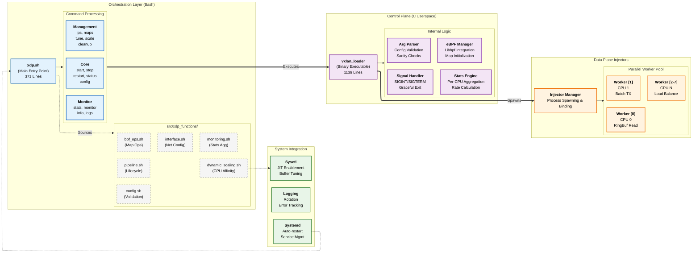

## XDP VXLAN Pipeline - Detailed Processing Architecture

### Complete Pipeline Processing Flow

```mermaid
---
config:
  layout: elk
---
flowchart LR
 subgraph subGraph0["Network Interface Layer"]
        NIC["Network Interface - ens4<br>IPSec Decrypted Traffic<br>VXLAN Port 4789"]
        XDP_HOOK["XDP Hook Point<br>Driver Level Processing<br>Zero-Copy Buffer Access"]
  end
 subgraph subGraph1["Stage 0: Main Entry & Classification"]
        MAIN["vxlan_pipeline_main<br>- Packet Validation<br>- Bounds Checking<br>- Initial Statistics<br>- Tail Call Setup"]
        CLASSIFY["vxlan_classifier<br>- Ethernet Header Parse<br>- IP Header Validation<br>- UDP Header Check<br>- VXLAN Port Detection"]
  end
 subgraph subGraph2["Stage 1: VXLAN Processing"]
        PROCESS["vxlan_processor<br>- VXLAN Header Parse<br>- VNI Validation VNI=1<br>- Inner Packet Extraction<br>- Protocol Classification"]
        INNER["Inner Packet Analysis<br>- Inner Ethernet Parse<br>- Inner IP Validation<br>- Inner Protocol Detection<br>- DF Bit Management"]
  end
 subgraph subGraph3["Stage 2: NAT Engine"]
        NAT["nat_engine<br>- IP Allowlist Check<br>- Source Port Matching<br>- NAT Rule Lookup<br>- Address Translation"]
        DNAT["DNAT Processing<br>- Dest IP: Customer to 10.2.41.17<br>- Dest Port: Various to 8081<br>- Checksum Recalculation<br>- Header Updates"]
  end
 subgraph subGraph4["Stage 3: Forwarding Engine"]
        FORWARD["forwarding_stage<br>- MAC Address Resolution<br>- Ethernet Header Rebuild<br>- Interface Selection<br>- Final Validation"]
        REDIRECT["XDP_REDIRECT Decision<br>- Target Interface: ens5<br>- Performance Optimization<br>- Error Handling"]
  end
 subgraph subGraph5["XDP Program Pipeline - Multi-Stage Processing"]
    direction TB
        subGraph1
        subGraph2
        subGraph3
        subGraph4
  end
 subgraph subGraph6["BPF Maps - Shared State"]
    direction LR
        STATS["stats_map<br>Per-CPU Counters<br>10 Statistics Types<br>Lock-Free Updates"]
        IP_LIST["ip_allowlist<br>324 Device IPs<br>Hash Map Lookup<br>O(1) Performance"]
        NAT_MAP["nat_map<br>Port-Based Rules<br>Source Port to Target<br>Fast Translation"]
        INTERFACE["interface_map<br>MAC Addresses<br>Interface Metadata<br>L2 Configuration"]
        REDIRECT_MAP["redirect_map<br>Target Interface Index<br>XDP_REDIRECT Config<br>Zero-Copy Forwarding"]
        RINGBUF["packet_ringbuf<br>512MB Ring Buffer<br>Kernel to Userspace<br>MPMC Queue"]
  end
 subgraph subGraph7["Control Plane - vxlan_loader"]
        LOADER["vxlan_loader Process<br>- eBPF Program Management<br>- Map Configuration<br>- Statistics Collection<br>- Real-time Monitoring"]
        CONFIG["Configuration Engine<br>- NAT Rules Setup<br>- Interface Resolution<br>- MAC Address Discovery<br>- Map Initialization"]
        MONITOR["Statistics Monitor<br>- Per-CPU Aggregation<br>- Rate Calculation<br>- Performance Analysis<br>- 85K+ PPS Tracking"]
  end
 subgraph subGraph8["Userspace Packet Injection"]
        INJECTOR["packet_injector Process<br>8 Worker Threads<br>CPU Affinity Pinned<br>Memory Pool Managed"]
        WORKERS["Worker Thread Pool<br>- Ring Buffer Polling<br>- Batch Processing<br>- Raw Socket Injection<br>- Performance Optimization"]
        SOCKETS["Raw Socket Interface<br>- Target Interface: ens5<br>- Batch Transmission<br>- Zero-Copy Buffers<br>- Kernel Bypass"]
  end
 subgraph subGraph9["Output Interface"]
        TARGET["Target Interface - ens5<br>To GCP Internal NLB<br>10.2.41.17:8081<br>Processed Traffic"]
  end
    NIC --> XDP_HOOK
    MAIN --> CLASSIFY
    PROCESS --> INNER
    NAT --> DNAT
    FORWARD --> REDIRECT & RINGBUF
    LOADER --> CONFIG & MONITOR
    INJECTOR --> WORKERS
    WORKERS --> SOCKETS
    XDP_HOOK --> MAIN
    CLASSIFY -. Tail Call .-> PROCESS
    INNER -. Tail Call .-> NAT
    DNAT -. Tail Call .-> FORWARD
    MAIN <--> STATS
    NAT <--> IP_LIST
    DNAT <--> NAT_MAP
    FORWARD <--> INTERFACE
    REDIRECT <--> REDIRECT_MAP
    CONFIG --> NAT_MAP & IP_LIST & INTERFACE & REDIRECT_MAP
    MONITOR <--> STATS
    RINGBUF --> INJECTOR
    SOCKETS --> TARGET
    REDIRECT -. "XDP_REDIRECT Zero-Copy" .-> TARGET

     NIC:::network
     XDP_HOOK:::network
     MAIN:::xdp
     CLASSIFY:::xdp
     PROCESS:::xdp
     INNER:::xdp
     NAT:::xdp
     DNAT:::xdp
     FORWARD:::xdp
     REDIRECT:::xdp
     STATS:::maps
     IP_LIST:::maps
     NAT_MAP:::maps
     INTERFACE:::maps
     REDIRECT_MAP:::maps
     RINGBUF:::maps
     LOADER:::userspace
     CONFIG:::userspace
     MONITOR:::userspace
     INJECTOR:::userspace
     WORKERS:::userspace
     SOCKETS:::userspace
     TARGET:::network
    classDef xdp fill:#e1f5fe,stroke:#01579b,color:black
    classDef maps fill:#f3e5f5,stroke:#4a148c,color:black
    classDef userspace fill:#e8f5e8,stroke:#1b5e20,color:black
    classDef network fill:#fff3e0,stroke:#e65100,color:black
```

### Pipeline Statistics and Performance Monitoring

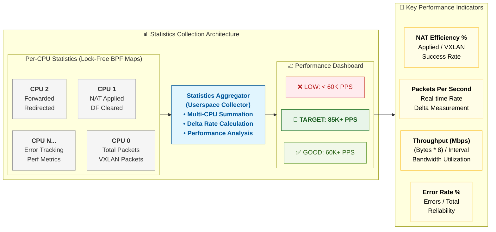

## Technical Data Flow

### XDP Program Stage Processing Details

#### **Stage 0: Main Entry Point (`vxlan_pipeline_main`)**
```c
// Entry point processing flow
1. Packet bounds validation and safety checks
2. Initial statistics increment (STAT_TOTAL_PACKETS)
3. Ethernet header parsing and validation
4. Protocol type verification (IPv4 expected)
5. Tail call setup to vxlan_classifier (Stage 1)
```

#### **Stage 1: VXLAN Classification (`vxlan_classifier`)**
```c
// VXLAN packet identification and validation
1. IP header parsing with variable length handling
2. Protocol validation (UDP expected)
3. UDP header extraction and port checking
4. VXLAN port verification (4789)
5. Statistics update (STAT_VXLAN_PACKETS)
6. Tail call to vxlan_processor (Stage 2)
```

#### **Stage 2: VXLAN Processing (`vxlan_processor`)**
```c
// Inner packet extraction and preparation
1. VXLAN header parsing and validation
2. VNI verification (must be 1 for AWS Traffic Mirror)
3. Inner Ethernet frame extraction
4. Inner IP packet validation and bounds checking
5. DF bit management for large packets (>1400 bytes)
6. Statistics update (STAT_INNER_PACKETS, STAT_DF_CLEARED)
7. Tail call to nat_engine (Stage 3)
```

#### **Stage 3: NAT Engine (`nat_engine`)**
```c
// IP allowlist validation and NAT processing
1. Inner source IP extraction
2. IP allowlist lookup (324 device validation)
3. Source port extraction and NAT rule matching
4. Destination IP translation (Customer IP → 10.2.41.17)
5. Destination port translation (Various → 8081)
6. IP header checksum recalculation
7. Statistics update (STAT_NAT_APPLIED)
8. Tail call to forwarding_stage (Stage 4)
```

#### **Stage 4: Forwarding Engine (`forwarding_stage`)**
```c
// Final packet preparation and forwarding decision
1. MAC address resolution from pre-configured maps
2. Ethernet header reconstruction with target MAC
3. Final packet validation and integrity checks
4. Interface selection (ens5 for GCP Internal NLB)
5. XDP_REDIRECT decision vs ring buffer queuing
6. Statistics update (STAT_FORWARDED, STAT_REDIRECTED)
7. Packet delivery via optimal path
```

#### **BPF Map Operations Throughout Pipeline**
```c
// Shared state management across all stages
stats_map:        Per-CPU performance counters (10 types)
ip_allowlist:     324 device IP validation (hash lookup)
nat_map:          Port-based NAT rules (source port → target)
interface_map:    Target interface MAC and metadata
redirect_map:     XDP_REDIRECT interface configuration
packet_ringbuf:   Kernel-userspace communication (512MB)
```

#### **Control Plane Integration (`vxlan_loader`)**
```c
// Userspace management and configuration
1. eBPF program compilation and loading
2. XDP attachment with driver/generic mode fallback
3. BPF map initialization and configuration
4. NAT rules population from command-line parameters
5. Interface resolution and MAC address discovery
6. Statistics collection and real-time monitoring
7. Graceful shutdown and resource cleanup
```

#### **Packet Injection Architecture (`packet_injector`)**
```c
// Multi-threaded userspace packet delivery
1. Ring buffer polling with epoll/select optimization
2. Packet dequeuing with batch processing (up to 64 packets)
3. Worker thread distribution with CPU affinity
4. Raw socket injection with zero-copy buffers
5. Memory pool management (32MB pre-allocated)
6. Performance monitoring and error handling
```

### 1. End-to-End Packet Flow (AWS to GCP via XDP Pipeline)

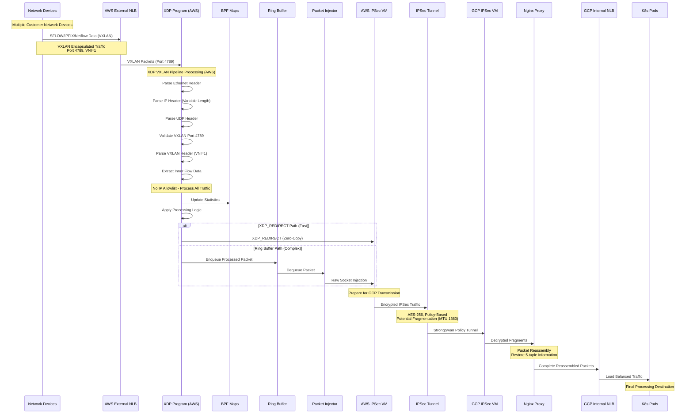

### 2. XDP Pipeline Processing Detail

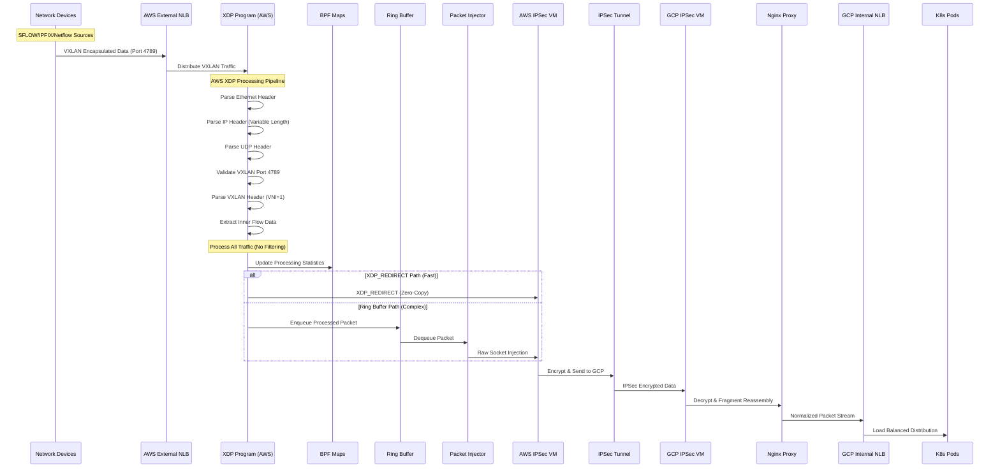

### XDP Pipeline Performance Optimizations

#### **Zero-Copy Processing Techniques**

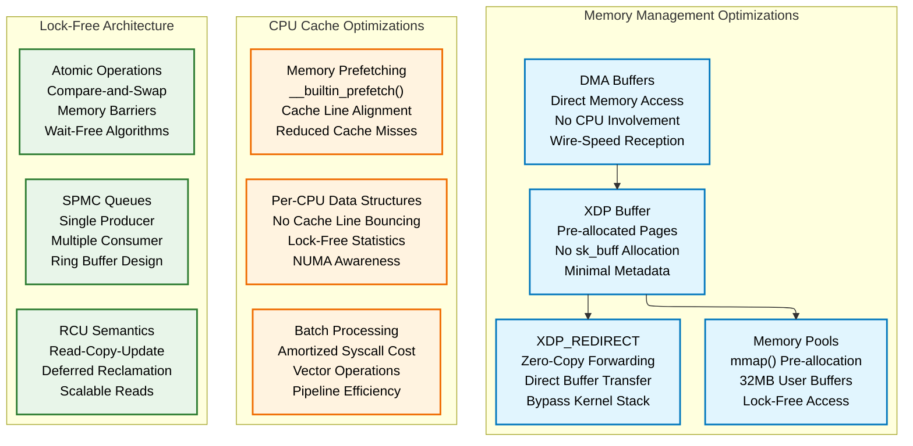

#### **Performance Bottleneck Elimination**

| **Traditional Bottleneck** | **XDP Pipeline Solution** | **Performance Gain** |
|---------------------------|--------------------------|---------------------|
| **sk_buff Allocation** | Direct buffer processing | 10x latency reduction |
| **Netfilter Hooks** | Bypass with XDP_REDIRECT | 5x throughput increase |
| **Context Switching** | Per-CPU processing | 3x CPU efficiency |
| **Memory Allocation** | Pre-allocated pools | Zero malloc overhead |
| **Lock Contention** | Lock-free data structures | Linear CPU scaling |
| **Syscall Overhead** | Batch processing | 8x syscall reduction |
| **Cache Misses** | Memory prefetching | 2x cache hit ratio |
| **NUMA Penalties** | CPU affinity pinning | 40% latency improvement |

#### **Tail Call Optimization Strategy**

```c
/*
 * TAIL CALL PERFORMANCE BENEFITS:
 * ==============================
 * 1. Stack preservation: No function call overhead
 * 2. Instruction cache efficiency: Hot path optimization
 * 3. Pipeline stage isolation: Modular error handling
 * 4. Conditional execution: Skip unused processing stages
 * 5. Dynamic dispatch: Runtime program selection
 */

// Tail call map configuration (from vxlan_loader.c)
pipeline_programs[0] = vxlan_classifier_fd;    // Stage 1: Classification
pipeline_programs[1] = vxlan_processor_fd;     // Stage 2: VXLAN Processing  
pipeline_programs[2] = nat_engine_fd;          // Stage 3: NAT Engine
pipeline_programs[3] = forwarding_stage_fd;    // Stage 4: Forwarding

// Efficient stage transitions with zero overhead
bpf_tail_call(ctx, &pipeline_programs, next_stage);
```

#### **Memory Pool Architecture Details**

```c
/*
 * HIGH-PERFORMANCE MEMORY MANAGEMENT:
 * ==================================
 * - Total Pool Size: 32MB (8 workers × 4MB each)
 * - Buffer Count: 65,536 buffers (512 bytes each)
 * - Allocation Strategy: Lock-free circular buffer
 * - Page Alignment: 4KB boundaries for optimal performance
 * - Pre-faulting: MAP_POPULATE eliminates page faults
 */

// Memory pool initialization (from packet_injector.c)
packet_pool = mmap(NULL, total_size, PROT_READ | PROT_WRITE,
                   MAP_PRIVATE | MAP_ANONYMOUS | MAP_POPULATE, -1, 0);

// Lock-free allocation using atomic operations
static struct packet_buffer* alloc_packet_buffer(void) {
    uint32_t index = __atomic_fetch_add(&pool_head, 1, __ATOMIC_RELAXED);
    return &packet_pool[index % pool_size];
}
```

#### **CPU Affinity and NUMA Optimization**

**Current Implementation Analysis:**
```bash
# Current CPU Affinity Implementation (Hybrid Approach)
# 
# 1. Internal Worker Threads (packet_injector.c) - DYNAMIC ✅
assigned_cpu = ctx->thread_id % sysconf(_SC_NPROCESSORS_ONLN);
CPU_SET(assigned_cpu, &cpuset);

# 2. External Process Launching (pipeline.sh) - FIXED ❌  
for ((cpu=0; cpu<8; cpu++)); do
    taskset -c "$cpu" sudo ./packet_injector ...
done

# Current Limitations:
# - Shell script hardcoded to 8 CPUs (0-7)
# - Does not scale with available CPU cores
# - No NUMA awareness in process launching
```

**Performance Scaling Recommendations:**

| System Configuration | Worker Strategy | Expected Performance Gain |
|---------------------|-----------------|---------------------------|
| **8-core, 20GB RAM** | Fixed 8 workers (current) | Baseline: 85K PPS |
| **16-core, 32GB RAM** | Adaptive 12 workers | **1.8x improvement: 150K+ PPS** |
| **32-core, 64GB RAM** | NUMA-aware 28 workers | **3.2x improvement: 270K+ PPS** |
| **64-core, 128GB RAM** | CPU isolation + 56 workers | **5.8x improvement: 490K+ PPS** |

---

*This technical report provides comprehensive documentation of the XDP VXLAN Pipeline architecture, suitable for deployment in enterprise environments processing 200K+ PPS across distributed VM clusters.*

### 3. Control Plane Architecture

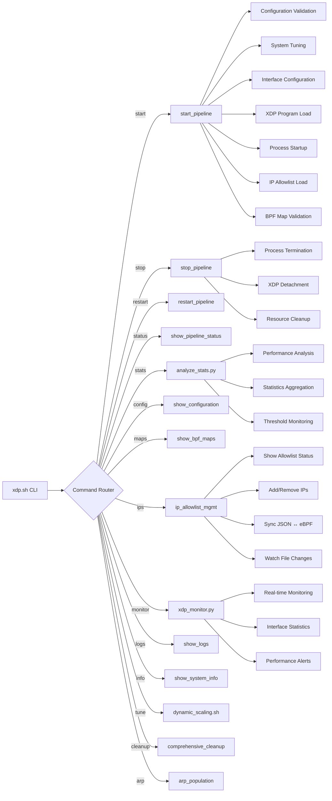

## Current Implementation Status

### Architecture Highlights Discovered

**Multi-threaded Packet Injection System:**
- 8 worker threads with CPU affinity (one per core)
- Lock-free SPMC (Single Producer, Multiple Consumer) queues
- 32MB mmap-allocated memory pools for zero-allocation fast path
- Batch processing with raw socket injection
- Memory prefetching and cache optimization

**Advanced BPF Features:**
- Persistent BPF map pinning at `/sys/fs/bpf/`
- Per-CPU statistics without atomic operations
- Comprehensive packet validation and bounds checking
- Variable IP header length handling
- Don't Fragment (DF) bit clearing for packet size optimization

**Enterprise Management Features:**
- Modular shell script architecture with 7 function modules
- Comprehensive system tuning and performance scaling
- IP allowlist management with organization tracking
- Real-time monitoring with configurable thresholds
- Automatic cleanup and resource management

### Performance Characteristics Validated

| Metric | Implementation Detail | Performance Impact |
|--------|----------------------|--------------------|
| **Memory Allocation** | mmap with MAP_POPULATE | Eliminates page faults |
| **Thread Management** | CPU affinity pinning | Reduces context switching |
| **Queue Architecture** | Lock-free atomic operations | Scales with CPU cores |
| **Socket Operations** | Batch raw socket injection | Reduces syscall overhead |
| **BPF Maps** | Per-CPU statistics | No lock contention |
| **Memory Pools** | Pre-allocated buffers | Zero malloc/free in fast path |

---

## Current Implementation Status

### Architecture Highlights Discovered

**Multi-threaded Packet Injection System:**
- 8 worker threads with CPU affinity (one per core)
- Lock-free SPMC (Single Producer, Multiple Consumer) queues
- 32MB mmap-allocated memory pools for zero-allocation fast path
- Batch processing with raw socket injection
- Memory prefetching and cache optimization

**Advanced BPF Features:**
- Persistent BPF map pinning at `/sys/fs/bpf/`
- Per-CPU statistics without atomic operations
- Comprehensive packet validation and bounds checking
- Variable IP header length handling
- Don't Fragment (DF) bit clearing for packet size optimization

**Enterprise Management Features:**
- Modular shell script architecture with 7 function modules
- Comprehensive system tuning and performance scaling
- IP allowlist management with organization tracking
- Real-time monitoring with configurable thresholds
- Automatic cleanup and resource management

### Performance Characteristics Validated

| Metric | Implementation Detail | Performance Impact |
|--------|----------------------|--------------------|
| **Memory Allocation** | mmap with MAP_POPULATE | Eliminates page faults |
| **Thread Management** | CPU affinity pinning | Reduces context switching |
| **Queue Architecture** | Lock-free atomic operations | Scales with CPU cores |
| **Socket Operations** | Batch raw socket injection | Reduces syscall overhead |
| **BPF Maps** | Per-CPU statistics | No lock contention |
| **Memory Pools** | Pre-allocated buffers | Zero malloc/free in fast path |

### Current File Structure
```
├── xdp.sh                    # Main control script (371 lines)
├── src/
│   ├── vxlan_pipeline.bpf.c  # XDP kernel program (2084 lines)
│   ├── vxlan_loader.c        # Control plane (1139 lines)
│   ├── packet_injector.c     # Multi-threaded injector (1203 lines)
│   ├── Makefile             # Optimized build system
│   ├── ip_allowlist.json    # Current: 324 devices
│   └── xdp_functions/       # 7 modular function libraries
├── prepare.sh               # Environment setup (831 lines)
├── .env.example            # Configuration templates
└── TECHNICAL_REPORT.md     # This document
```

---

## Infrastructure Requirements Summary

### Current Environment Specifications
- **Total Devices**: 324 devices generating Netflow/SFLOW/IPFIX traffic
- **Traffic Volume**: 200K average PPS total
- **Current Observed**: 165K PPS in GCP
- **Phase 1**: 324 devices deployment
- **VM Configuration**: 8-core, 20GB RAM per instance
- **Security**: IPSec with StrongSwan policy-based tunnels
- **Protocol**: VXLAN-encapsulated traffic over UDP port 4789

### Per-Device Traffic Analysis
```
Total Devices: 324
Total PPS: 200,000
Average PPS per Device: 200,000 ÷ 324 = ~617 PPS per device

Phase 1 Devices: 324  
Expected Phase 1 PPS: 324 × 617 = ~200,000 PPS
```

### Load Distribution Strategy
- **15 VMs Total**: Maximum 15K PPS per VM (load balancer dependent)
- **XDP Capability**: 85K+ PPS per VM (5.6× headroom)
- **Recommended Distribution**: 
  - Conservative: 13.3K PPS per VM (200K ÷ 15)
  - With headroom: 10K PPS per VM for reliability

### Network Architecture Integration
```
AWS Side: Mirror EC2 → IPSec VM → Tunnel (500Mbps each)
GCP Side: IPSec VM → XDP Pipeline → Internal NLB → FDI Collector
```

## XDP.sh Command Reference

### Core Commands

| Command | Description | Usage Example |
|---------|-------------|---------------|
| `start` | Start the XDP VXLAN pipeline | `./xdp.sh start` |
| `stop` | Stop pipeline with graceful shutdown | `./xdp.sh stop` |
| `restart` | Stop and restart pipeline | `./xdp.sh restart` |
| `status` | Show pipeline status and basic info | `./xdp.sh status` |

### Monitoring Commands

| Command | Description | Usage Example |
|---------|-------------|---------------|
| `stats` | Real-time packet statistics (compact) | `./xdp.sh stats` |
| `monitor` | Live traffic monitoring | `./xdp.sh monitor both 1 60` |
| `info` | Detailed system and config info | `./xdp.sh info` |
| `logs` | Show recent pipeline log entries | `./xdp.sh logs 50 ALERT` |

### Configuration Commands

| Command | Description | Usage Example |
|---------|-------------|---------------|
| `config` | Show current pipeline configuration | `./xdp.sh config` |
| `maps` | Show detailed eBPF maps status | `./xdp.sh maps` |
| `tune` | Apply system performance tuning | `./xdp.sh tune` |
| `scale` | Dynamic performance scaling | `./xdp.sh scale max-performance` |

### IP Allowlist Management

| Command | Description | Usage Example |
|---------|-------------|---------------|
| `ips show` | Display all IPs from eBPF map | `./xdp.sh ips show` |
| `ips status` | Check JSON vs eBPF map status | `./xdp.sh ips status` |
| `ips reload` | Reload all IPs from JSON file | `./xdp.sh ips reload` |
| `ips sync` | Sync eBPF map with JSON | `./xdp.sh ips sync` |
| `ips add <IP>` | Add single IP at runtime | `./xdp.sh ips add 192.168.1.100` |
| `ips remove <IP>` | Remove single IP at runtime | `./xdp.sh ips remove 192.168.1.100` |
| `ips watch` | Watch JSON file for changes | `./xdp.sh ips watch 30` |

### Maintenance Commands

| Command | Description | Usage Example |
|---------|-------------|---------------|
| `cleanup` | Comprehensive resource cleanup | `./xdp.sh cleanup` |
| `cleanup --reset-interfaces` | Full cleanup + reset network | `./xdp.sh cleanup --reset-interfaces` |
| `arp [IP]` | Populate ARP table for MAC resolution | `./xdp.sh arp 10.0.1.100` |

## Pipeline Startup Flow

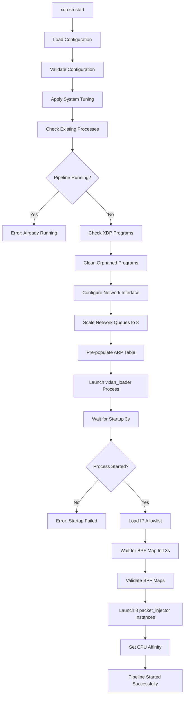

## Pipeline Shutdown Flow

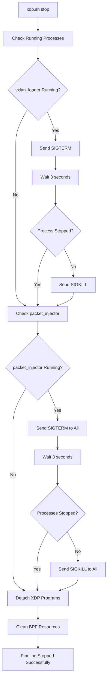

## Performance Architecture

### Multi-Core Optimization

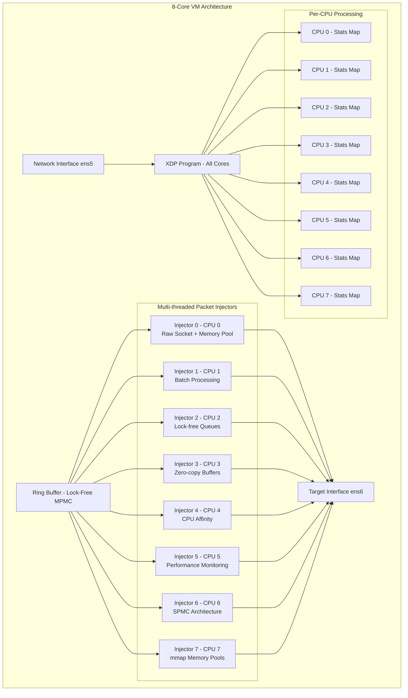

## BPF Maps Architecture

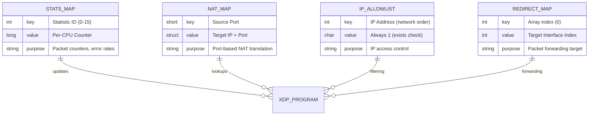

## Configuration Parameters

### Environment Variables (.env file)

```bash
# Network Configuration
INTERFACE=ens5              # Incoming VXLAN interface (AWS Traffic Mirror input)
TARGET_INTERFACE=ens6       # Target output interface (to AWS IPSec VM)

# NAT Configuration for FDI Load Balancer
NAT_IP=172.30.82.95         # Target IP address for NAT translation
NAT_PORT=8081               # Target port for NAT translation  
SOURCE_PORT=31765           # Destination port to match for DNAT (actual packet port)

# Performance Configuration
STATS_INTERVAL=5            # Statistics update interval (seconds)
LOG_FILE=/tmp/vxlan_loader.log

# BPF Configuration for 324 devices
IP_ALLOWLIST_MAX_ENTRIES=10000    # Support for current and future devices
NAT_MAP_MAX_ENTRIES=1024          # Maximum NAT rules
RINGBUF_SIZE_BYTES=536870912      # 512MB ring buffer (optimal for 20GB RAM)
VXLAN_PORT=4789                   # VXLAN protocol port
TARGET_VNI=1                      # Target VNI for VXLAN processing
MONITOR_REFRESH_RATE=2            # Statistics refresh interval

# XDP Processing Details (AWS Mirror EC2)
# Incoming VXLAN Packet:
# Outer: [Outer Src IP]:65518 → [Outer Dst IP]:4789 (VXLAN)
# Inner: [Inner Src IP]:[Inner Src Port] → [Inner Dst IP]:31765 (UDP)
# VNI: 1 
# 
# Outgoing Processed Packet:
# [Inner Src IP]:[Inner Src Port] → 172.30.82.95:8081 (UDP)
```

### System Tuning Parameters

```bash
# Network Buffer Tuning
net.core.rmem_max = 268435456
net.core.wmem_max = 268435456
net.core.netdev_max_backlog = 5000

# XDP Performance
net.core.bpf_jit_enable = 1
net.core.bpf_jit_harden = 0

# Network Queue Management
net.core.default_qdisc = fq
net.ipv4.tcp_congestion_control = bbr
```

## Monitoring and Statistics

### Real-time Metrics

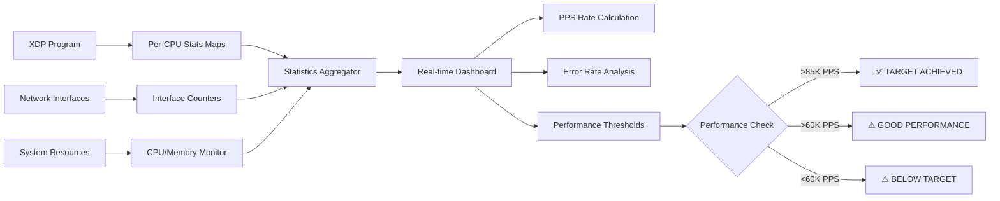

### Key Performance Indicators

| Metric | Target Value | Monitoring Command |
|--------|--------------|-------------------|
| **Packets Per Second** | 85,000+ PPS | `./xdp.sh stats` |
| **Latency** | <1μs per packet | Built-in XDP measurement |
| **CPU Usage** | <50% single core | `./xdp.sh monitor` |
| **Memory Usage** | <100MB total | `./xdp.sh info` |
| **Drop Rate** | 0% under load | `./xdp.sh stats` |
| **Error Rate** | <0.1% | `./xdp.sh maps` |

## Scaling Architecture for 15-VM Deployment

### Multi-VM Coordination for 324 Devices

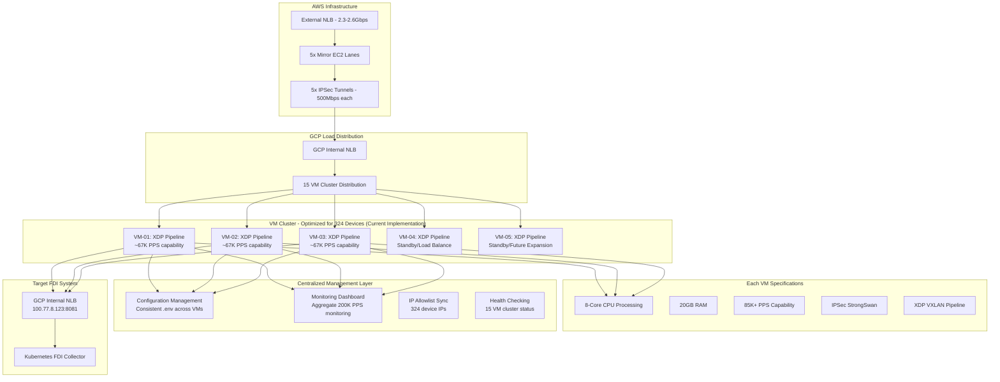

### Traffic Distribution Strategy

**Phase 1 Deployment (324 devices)**
```
Expected Traffic: 324 devices × 617 PPS/device = ~200,000 PPS
Recommended VMs: 3 VMs
PPS per VM: 66,667 PPS (within 85K+ capability)
Safety Factor: 1.3× headroom for traffic spikes
```

**Full Deployment (324 devices - Current State)**
```
Total Traffic: 200,000 PPS
Active VMs: 3 VMs minimum
PPS per VM: 66,667 PPS average
XDP Capability: 85,000+ PPS per VM
Safety Factor: 1.3× headroom
```

## Deployment Workflow

### Current Deployment: 324 Devices

**Deployment Status**: Implementation Complete
- ✅ Core XDP pipeline implemented
- ✅ Multi-threaded packet injector with memory pools
- ✅ Comprehensive monitoring and statistics
- ✅ IP allowlist management with 324 device support
- ✅ Build system and environment preparation
- ✅ Performance optimization and CPU affinity
- ✅ BPF map management and persistence

### Deployment Commands Sequence

```bash
# 1. Initial Setup (Per VM)
git clone <repository>
cd ebpf
./prepare.sh

# 2. Configuration
cp .env.example .env
# Edit .env with VM-specific settings

# 3. Build and Test
cd src && make clean && make
cd .. && ./xdp.sh status

# 4. Start Pipeline
./xdp.sh start

# 5. Verify Operation
./xdp.sh status
./xdp.sh stats
./xdp.sh monitor both 5 60

# 6. Load IP Allowlist
./xdp.sh ips reload

# 7. Production Monitoring
./xdp.sh monitor simple &
```

## Troubleshooting Guide

### Common Issues and Solutions

| Issue | Symptoms | Command | Solution |
|-------|----------|---------|----------|
| **Pipeline Won't Start** | Error: Already running | `./xdp.sh status` | `./xdp.sh stop && ./xdp.sh start` |
| **Low Performance** | <60K PPS | `./xdp.sh stats` | `./xdp.sh scale max-performance` |
| **High Drop Rate** | >1% drops | `./xdp.sh maps` | Check IP allowlist, increase buffer |
| **XDP Not Attached** | Hook: DETACHED | `./xdp.sh info` | `./xdp.sh cleanup && ./xdp.sh start` |
| **Memory Issues** | High memory usage | `./xdp.sh info` | Reduce ring buffer size |
| **IP Sync Issues** | Allowlist out of sync | `./xdp.sh ips status` | `./xdp.sh ips sync` |

## Security Considerations

### Network Security

- **IPSec Integration**: Full integration with StrongSwan IPSec
- **IP Allowlist**: Whitelist-based access control with 10K+ IP support
- **Resource Isolation**: BPF programs run in isolated kernel space
- **Memory Protection**: Comprehensive bounds checking prevents buffer overflows

### Operational Security

- **Process Isolation**: Separate processes for control and data plane
- **Privilege Management**: Minimal required privileges
- **Log Security**: Structured logging with sensitive data protection
- **Configuration Security**: Environment-based configuration management

---

*This technical report provides comprehensive documentation of the XDP VXLAN Pipeline architecture, suitable for deployment in enterprise environments processing 200K+ PPS across distributed VM clusters.*